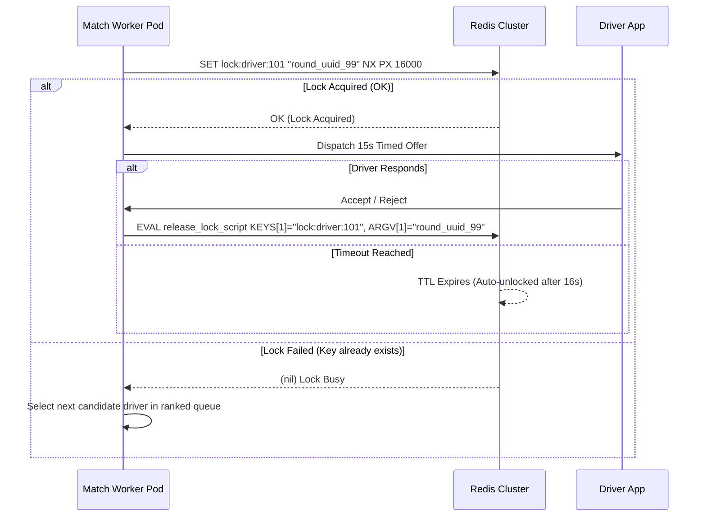

# ADR-0007: Distributed Locking Strategy for Driver Ride Dispatch using Redis & Lua Scripts

- **Status:** Accepted
- **Deciders:** Principal Distributed Systems Architect, Matching Engine Lead, Reliability Guild
- **Date:** 2026-02-18
- **Technical Story:** LOCK-MATCH-007 (Concurrency Control & Race Condition Prevention in Multi-Worker Dispatch)

---

## Context and Problem Statement

In the Matching Engine, multiple parallel workers operate across independent Kubernetes pods to evaluate candidate drivers for overlapping ride requests. If two riders book rides simultaneously within the same neighborhood:

1. Both match worker routines might identify the same nearest driver (`driver_42`).
2. Without concurrency control, both workers could dispatch concurrent 15-second ride offers to `driver_42`, or allocate the driver twice (**Double-Booking Race Condition**).
3. If a lock is held too long or if a worker crashes while holding a lock, the driver is frozen in a deadlocked state and cannot receive new rides.

We require a distributed locking mechanism that guarantees **Mutual Exclusion**, **Deadlock Safety (Auto-Expiry)**, and **Sub-Millisecond Acquisition Latency**.

---

## Decision Drivers

- **Sub-millisecond Lock Overhead:** Lock acquisition and release must execute in $< 2\text{ms}$ to avoid slowing down the 3-second match auction loop.
- **Mutual Exclusion (Safety Invariant):** Exactly one matching worker can hold a lock on a given `driver_id` at any time.
- **Automatic TTL Expiry:** If a match worker crashes or experiences network partition, the lock must automatically self-release within a fixed duration (e.g. 16 seconds).
- **Safe Atomic Release (Fencing Token / Value Check):** A worker must never accidentally release a lock that was acquired by another worker after the first worker's lock expired.

---

## Considered Options

1. **Redis Key Lock with Atomic Lua Scripts (`SET NX PX` + Safe Release Script)**
2. **Multi-Master Redlock Algorithm (5 independent Redis nodes)**
3. **Database Row Lock (`SELECT FOR UPDATE` in PostgreSQL)**
4. **Apache ZooKeeper / etcd distributed lock recipes**

---

## Decision Outcome

Chosen option: **Redis Key Lock with Atomic `SET ... NX PX` and Verified Value Release via Lua Script**.

### Lock Acquisition Specification

When an offer is dispatched to a driver:

```redis
SET lock:driver:{driver_id} "{match_round_uuid}" NX PX 16000
```

- `NX`: Set only if the key does not already exist (guarantees mutual exclusion).
- `PX 16000`: Auto-expire after 16,000 milliseconds (15s driver response window + 1s network buffer).
- `Value`: Unique UUID per match attempt (fencing token).

### Atomic Safe Release via Lua Script

A worker must release the lock only if the value in Redis still matches its own unique `match_round_uuid`:

```lua
-- Atomic Lua Script executed via EVALSHA in Redis
if redis.call("get", KEYS[1]) == ARGV[1] then
    return redis.call("del", KEYS[1])
else
    return 0 -- Lock was already expired or reassigned
end
```

### Driver Offer State Pipeline



---

## Rationale for Single-Cluster vs Redlock

- In our architecture, a Redis Cluster with 16 master shards and in-memory replication is already deployed for spatial caching.
- Lock acquisition takes $< 0.8\text{ms}$ over local VPC networks.
- In the exceedingly rare event of a master node failover during lock acquisition, the worst-case scenario is an offer reject or fallback re-dispatch, which the Order State Machine handles idempotently. Redlock across 5 independent clusters was deemed unnecessary operational overhead.
