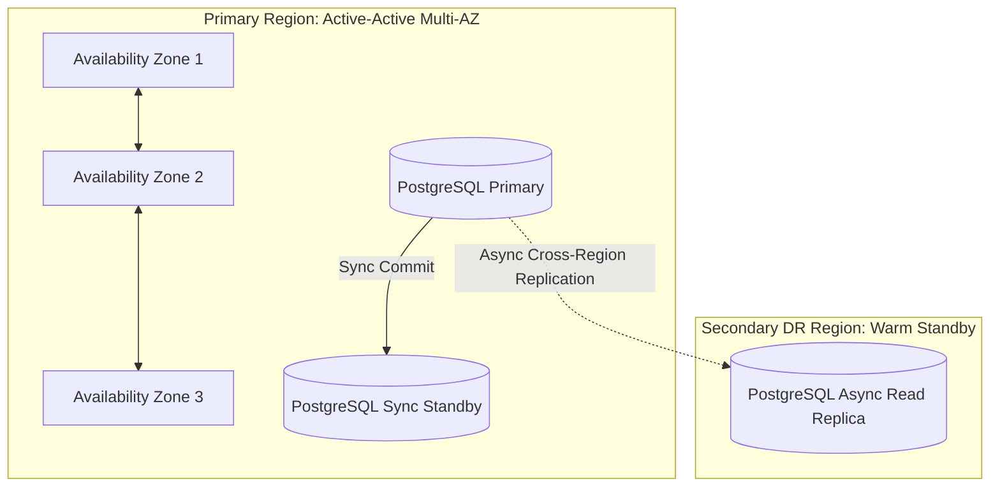

# Non-Functional Requirements: Fault Tolerance, High Availability & SLA

This document details the availability targets, disaster recovery objectives, resilience patterns, and failure mode mitigations for the platform.

---

## 1. Availability Targets & SLA / SLO

| System Tier                          | Target Availability      | Max Allowed Unplanned Downtime / Year | Target RPO              | Target RTO            |
| :----------------------------------- | :----------------------- | :------------------------------------ | :---------------------- | :-------------------- |
| **Active Ride Lifecycle & Tracking** | **99.99%** (Four Nines)  | $\le 52.6\text{ minutes}$             | $\approx 0\text{ sec}$  | $< 30\text{ seconds}$ |
| **Driver Location Ingestion**        | **99.95%**               | $\le 4.38\text{ hours}$               | $< 3\text{ sec}$        | $< 1\text{ minute}$   |
| **Financial Ledger & Billing**       | **99.999%** (Five Nines) | $\le 5.26\text{ minutes}$             | $\mathbf{0\text{ sec}}$ | $< 1\text{ minute}$   |
| **B2B Web Portal & Analytics**       | **99.90%**               | $\le 8.76\text{ hours}$               | $< 5\text{ min}$        | $< 15\text{ minutes}$ |

---

## 2. Disaster Recovery Strategy (RPO / RTO)

- **Recovery Point Objective (RPO):**
  - **Financial Transactions & Rides:** $\text{RPO} = 0$. Synchronous multi-AZ database replication ensures committed transactions are never lost.
  - **GPS Telemetry Streams:** $\text{RPO} \le 3\text{ seconds}$. Ephemeral coordinate streams can be recovered via mobile client re-transmission.
- **Recovery Time Objective (RTO):**
  - **AZ Failure:** $\text{RTO} < 30\text{ seconds}$ via automated AWS Aurora / Kubernetes pod rescheduling.
  - **Region-wide Catastrophic Failure:** $\text{RTO} < 15\text{ minutes}$ via automated Route53 DNS failover to the secondary warm standby region.

---

## 3. Resilience & Failure Isolation Patterns

### 3.1 Circuit Breakers & Fallbacks (Resilience4j / Envoy)

- **Map & Routing Outage Fallback:**
  - If third-party routing APIs (Google Maps/Mapbox) experience timeout spikes ($> 200\text{ms}$) or failure rates ($> 5\%$), circuit breakers trip immediately.
  - The system automatically falls back to self-hosted internal **OSRM/Valhalla** clusters or computes approximate geodesic Haversine distance multiplied by an urban Manhattan detour factor ($D \approx D_{\text{haversine}} \times 1.35$).
- **Surge Pricing Engine Outage Fallback:**
  - If the real-time dynamic surge ML engine is unreachable, default to static time-of-day baseline multiplier matrix rather than blocking ride creation.

### 3.2 Idempotency & Exactly-Once Semantics

Every state-mutating HTTP and gRPC request must supply an `Idempotency-Key` header (UUID v4):

- Edge Gateway caches responses for duplicate idempotency keys in Redis for $\mathbf{24\text{ hours}}$.
- In event consumer pipelines, a deduplication filter checks an in-memory Bloom filter backed by a PostgreSQL unique constraint table (`processed_events`).

### 3.3 Rate Limiting & Graceful Degradation

Under extreme traffic surges (e.g. New Year's Eve, severe weather):

1. **Tier 1 Shedding:** Disable non-essential features (e.g., historical heatmap visualization, detailed driver vehicle animation on passenger radar).
2. **Tier 2 Shedding:** Reduce driver location telemetry frequency from $1\text{s}$ to $3\text{s}$.
3. **Tier 3 Protection:** Enforce virtual waiting room queue at API Gateway for new ride quotes while prioritizing in-progress active trips.
