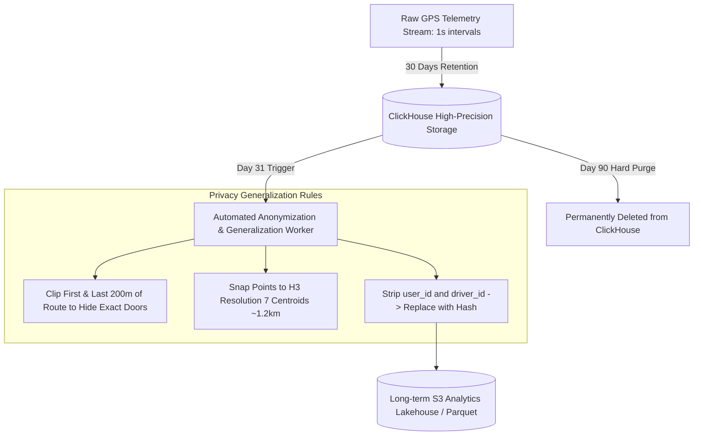

# Non-Functional Requirements: Data Privacy, GDPR / CCPA Compliance & Retention Policies

This document establishes the data lifecycle governance, Personally Identifiable Information (PII) protection, GPS trajectory anonymization rules, and "Right to be Forgotten" implementation patterns.

---

## 1. Data Classification Taxonomy

| Classification Level     | Examples                                                                        | Encryption & Vaulting Standard                                                           | Storage Destination                     |
| :----------------------- | :------------------------------------------------------------------------------ | :--------------------------------------------------------------------------------------- | :-------------------------------------- |
| **Restricted PII**       | Full name, phone number, email address, driver license photo, tax ID.           | AES-256 field-level encryption (PostgreSQL `pgcrypto` / HashiCorp Vault Transit Engine). | Isolated Core DB `users_pii` partition. |
| **Payment Sensitive**    | Card brand, last 4 digits, expiry, PSP token.                                   | PCI DSS SAQ-A compliant tokenization.                                                    | Stored as non-sensitive tokens only.    |
| **Geospatial Telemetry** | High-precision raw GPS coordinates ($< 1\text{m}$), timestamps, speed, bearing. | In-transit TLS 1.3, at-rest volume encryption. Retention TTL: 30 days.                   | ClickHouse OLAP & S3 Cold Bucket.       |
| **Operational Public**   | H3 Hex indices, aggregated surge multipliers, city tariff schedules.            | Standard database at-rest encryption.                                                    | Redis Cluster & Core DB.                |

---

## 2. Geospatial Telemetry Retention & Anonymization Pipeline

Raw GPS breadcrumb coordinates generated during rides present sensitive privacy concerns regarding rider trip history (revealing home addresses, medical clinics, workplaces).



### Privacy Rules for Ride History

1. **Safety Window (0–30 Days):** Full precision GPS track retained for police inquiries, insurance claims, and route dispute arbitration.
2. **Post-30 Days Anonymization:**
   - Exact pickup and drop-off coordinates are clipped by $200\text{ meters}$ (generalized to street centroid).
   - Foreign key bindings to `passenger_id` are unlinked and replaced with an irreversible one-way cryptographic hash:
     $$\text{Anonymized\_ID} = \text{HMAC-SHA256}(\text{passenger\_id}, \text{SecretSalt})$$

---

## 3. "Right to be Forgotten" (GDPR Article 17 / CCPA)

When a customer or driver partner requests account deletion:

- **Immediate Action (Within 24 Hours):**
  - Revoke all active OAuth tokens, invalidate sessions in Redis.
  - Anonymize `users` table record:
    ```sql
    UPDATE users
    SET full_name = 'DELETED_USER',
        email = CONCAT('deleted_', id, '@anonymized.mobility.io'),
        phone_number = CONCAT('+000000', RIGHT(id::text, 6)),
        is_active = false
    WHERE id = :user_id;
    ```
- **Financial Exemption Notice:**
  - In compliance with statutory tax and Anti-Money Laundering (AML) laws, financial records in `ledger_entries` and `payment_transactions` are retained for 7 years, but unlinked from non-essential PII.
