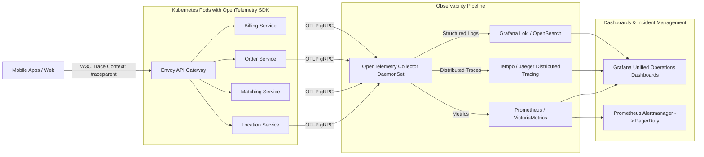

# Non-Functional Requirements: Observability, Distributed Tracing & Metrics Standards

This specification establishes the standards for telemetry collection, distributed request tracing, metrics instrumentation, alerting thresholds, and incident resolution SLAs.

---

## 1. Observability Golden Signals & Architecture

---

## 2. Distributed Tracing Standards (W3C Trace Context)

Every incoming HTTP, gRPC, and WebSocket connection at the Envoy API Gateway is tagged with a standard **W3C Trace Context**:

- **Header:** `traceparent: 00-4bf92f3577b34da6a3ce929d0e0e4736-00f067aa0ba902b7-01`
- **Propagation:**
  - Microservices must propagate the `traceparent` context across all internal gRPC calls, database queries (via SQL comments), and Kafka message headers.
  - When a message is written to Kafka (e.g. `order.lifecycle.events`), the `trace_id` and `span_id` are injected into the Kafka record header to maintain trace continuity through asynchronous consumer pipelines.

---

## 3. Core Metrics Catalog

### 3.1 RED Metrics (Rate, Errors, Duration) for Key Services

| Service             | Key Metric Name                      | Type      | Alert Threshold                | Severity |
| :------------------ | :----------------------------------- | :-------- | :----------------------------- | :------- |
| **API Gateway**     | `http_requests_total`                | Counter   | Error rate $> 1.0\%$ over 5m   | Critical |
| **API Gateway**     | `http_request_duration_seconds`      | Histogram | P99 $> 250\text{ms}$ over 5m   | High     |
| **Location Ingest** | `driver_telemetry_ingest_rate`       | Gauge     | Sudden drop $> 25\%$           | Critical |
| **Matching Engine** | `match_auction_fulfillment_ratio`    | Gauge     | Ratio $< 85\%$ in city cluster | High     |
| **Matching Engine** | `driver_offer_timeout_ratio`         | Gauge     | Timeout $> 35\%$               | Medium   |
| **Kafka Consumers** | `kafka_consumer_lag_records`         | Gauge     | Lag $> 10,000$ records for 2m  | High     |
| **Billing Ledger**  | `billing_reconciliation_discrepancy` | Counter   | Value $> 0$                    | Critical |

---

## 4. Incident Response SLAs

| Severity Level    | Definition                                                                 | Mean Time to Detect (MTTD) | Mean Time to Acknowledge (MTTA) | Mean Time to Resolve (MTTR) |
| :---------------- | :------------------------------------------------------------------------- | :------------------------- | :------------------------------ | :-------------------------- |
| **P1 - Critical** | Platform outage, ride matching halted, payment capture failing.            | $< 2\text{ minutes}$       | $< 5\text{ minutes}$            | $< 20\text{ minutes}$       |
| **P2 - High**     | Degraded performance in a geographic region, surge pricing delayed.        | $< 5\text{ minutes}$       | $< 15\text{ minutes}$           | $< 45\text{ minutes}$       |
| **P3 - Medium**   | B2B Portal slow report generation, non-critical driver document OCR delay. | $< 15\text{ minutes}$      | $< 1\text{ hour}$               | $< 4\text{ hours}$          |
| **P4 - Low**      | Minor UI inconsistencies, non-blocking telemetry logging noise.            | $< 1\text{ day}$           | $< 1\text{ business day}$       | Next Sprint                 |
