# Non-Functional Requirements: Performance & Scalability

This document establishes the quantitative throughput targets, latency service level objectives (SLOs), and architectural scalability patterns for the Urban Mobility Platform.

---

## 1. Workload Profiles & Target Throughput

The architecture is designed to support a metropolitan market with up to **100,000 active concurrent drivers** and **500,000 active concurrent passengers** during peak commute hours.

| System Subsystem             | Metric                             | Peak Target                  | Sustained Average            | Scaling Strategy                                    |
| :--------------------------- | :--------------------------------- | :--------------------------- | :--------------------------- | :-------------------------------------------------- |
| **Location Ingestion**       | Incoming GPS telemetry updates     | $50,000\text{ updates/s}$    | $20,000\text{ updates/s}$    | Horizontal stateless ingestors + Go channels        |
| **Active Passenger Radar**   | Nearby driver search queries       | $15,000\text{ QPS}$          | $5,000\text{ QPS}$           | Redis H3 spatial replica clusters + in-memory cache |
| **Ride Booking / Quotes**    | Fare estimation & route queries    | $5,000\text{ RPS}$           | $1,200\text{ RPS}$           | Distance Matrix caching + OSRM cluster              |
| **Matching & Dispatch**      | Match auction batches              | $2,000\text{ matches/s}$     | $500\text{ matches/s}$       | 3-second discrete time-window batching workers      |
| **Billing Ledger**           | Financial journal transactions     | $1,500\text{ TPS}$           | $400\text{ TPS}$             | Dedicated PostgreSQL Aurora cluster with read pools |
| **WebSocket / Push Gateway** | Concurrent open socket connections | $600,000\text{ connections}$ | $250,000\text{ connections}$ | Envoy edge gateway + eBPF socket multiplexing       |

---

## 2. Latency Service Level Objectives (SLOs)

All latencies are measured from the edge API Gateway ingress to response dispatch (excluding public cellular network transit time).

```mermaid
gantt
    title Latency Budget Breakdown (P99 Targets in Milliseconds)
    dateFormat X
    axisFormat %s ms

    section Location Broadcast
    Ingest & Deadband Filter : 0, 5
    H3 Index & Redis Write   : 5, 15
    Kafka Emit               : 15, 25

    section Search & Quote
    Auth & Rate Limit        : 0, 10
    OSRM Routing Matrix      : 10, 60
    Surge Price Calculation  : 60, 80
    Redis Driver Pool Query  : 80, 100
    Response Serialization   : 100, 110

    section Dispatch Offer
    Candidate H3 Spatial Filter : 0, 20
    Ranking & Driver Scoring   : 20, 50
    Driver Lock & Push Emit    : 50, 80
```

### Quantitative Latency Targets

| User Journey / Operation                 | P50 Latency       | P95 Latency       | P99 Latency       | Max Allowable Timeout |
| :--------------------------------------- | :---------------- | :---------------- | :---------------- | :-------------------- |
| **GPS Telemetry Processing**             | $< 10\text{ ms}$  | $< 25\text{ ms}$  | $< 50\text{ ms}$  | $200\text{ ms}$       |
| **Nearby Drivers View (Radar)**          | $< 30\text{ ms}$  | $< 70\text{ ms}$  | $< 120\text{ ms}$ | $500\text{ ms}$       |
| **Fare Estimate & Route Quote**          | $< 45\text{ ms}$  | $< 90\text{ ms}$  | $< 150\text{ ms}$ | $1,000\text{ ms}$     |
| **Ride Creation & Pre-Auth**             | $< 120\text{ ms}$ | $< 250\text{ ms}$ | $< 450\text{ ms}$ | $2,000\text{ ms}$     |
| **Driver Offer Push Dispatch**           | $< 40\text{ ms}$  | $< 80\text{ ms}$  | $< 150\text{ ms}$ | $500\text{ ms}$       |
| **Trip State Transition (e.g. Arrived)** | $< 25\text{ ms}$  | $< 60\text{ ms}$  | $< 100\text{ ms}$ | $1,000\text{ ms}$     |

---

## 3. Horizontal Scaling & Partitioning Architecture

### 3.1 Geospatial Sharding with H3

To eliminate cross-node bottlenecks, matching and search operations are partitioned by geographical market clusters using **H3 Resolution 4/5 index IDs**. Nodes in the matching cluster only subscribe to Kafka partitions and Redis keys relevant to their assigned spatial boundaries.

### 3.2 Database Read/Write Splitting

- **Core PostgreSQL:** 1 Primary Writer + 4 Read Replicas behind PgBouncer.
- **Billing PostgreSQL:** Dedicated primary with synchronous standby in secondary AZ; read replicas serve read-only financial reports and invoice downloads.
- **Redis Spatial Cache:** Redis Cluster with 16 master shards, each with 1 replica, sharded by `hash_tag` (`{h3_cell_res7}:driver_id`).

### 3.3 Traffic Throttling & Backpressure

- **Rate Limiting at Edge:** Token Bucket algorithm implemented in Envoy API Gateway:
  - Driver GPS telemetry: Max 1 update / 1.5s per driver.
  - Passenger quote requests: Max 20 requests / minute per user.
- **Deadband Filter:** Mobile driver app omits coordinate transmissions if vehicle has moved $< 2\text{ meters}$ and speed is $0\text{ km/h}$.
