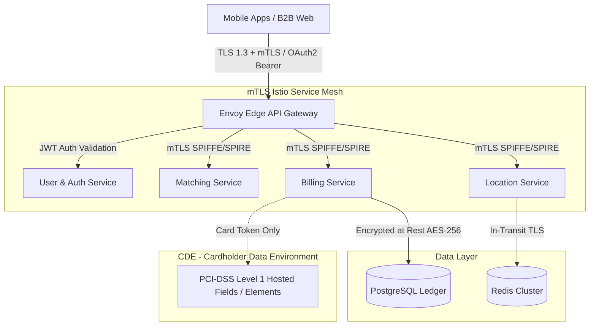

# Non-Functional Requirements: Security & PCI DSS Compliance

This specification outlines the security architecture, authentication standards, role-based access controls, cryptographic invariants, and PCI DSS compliance mandates across the platform.

---

## 1. Zero-Trust Network & Identity Architecture



---

## 2. Authentication & Authorization Framework

### 2.1 Identity Providers & Token Lifecycle

- **End-User / Driver Authentication:** Phone number verification via SMS OTP + Passwordless Passkeys (FIDO2/WebAuthn).
- **JWT Token Spec:** Signed via asymmetric RSA-4096 (RS256) or EdDSA.
  - Short-lived Access Tokens: Lifetime $\mathbf{15\text{ minutes}}$.
  - Refresh Tokens: Lifetime $\mathbf{30\text{ days}}$, stored securely in device hardware keystore (iOS Keychain / Android Keystore) with rotation on every refresh.
- **B2B & Administrative Auth:** OpenID Connect (OIDC) / SAML 2.0 integration with Corporate IdPs (Okta, Azure AD, Google Workspace) + mandatory Multi-Factor Authentication (MFA).

### 2.2 Role-Based Access Control (RBAC) & Scopes

| Role                  | Permitted Scope                                          | Data Access Restrictions                                            |
| :-------------------- | :------------------------------------------------------- | :------------------------------------------------------------------ |
| `ROLE_PASSENGER`      | `rides:request`, `rides:read_own`, `payments:manage_own` | Strict row-level isolation to owned user entity                     |
| `ROLE_DRIVER`         | `rides:accept`, `telemetry:push`, `earnings:read_own`    | Access restricted to assigned rides and own payouts                 |
| `ROLE_B2B_DISPATCHER` | `b2b:book_rides`, `b2b:view_employees`, `b2b:invoices`   | Multi-tenant partition filter by `tenant_id`                        |
| `ROLE_SUPPORT_AGENT`  | `support:view_trips`, `support:adjust_fare`              | Masked PII view; all manual adjustments audit-logged                |
| `ROLE_SUPER_ADMIN`    | `*`                                                      | Requires hardware MFA key + Dual-custody approval for balance edits |

---

## 3. PCI DSS Level 1 Compliance & Tokenization

To minimize PCI DSS audit scope (Cardholder Data Environment - CDE), the platform operates under **SAQ-A / SAQ-A-EP**:

- **Zero Card Storage:** Primary Account Numbers (PAN), CVV/CVC codes, and PIN blocks are **never stored, processed, or transmitted** on platform backend servers.
- **Client-Side Tokenization:** Mobile apps and web portals embed PSP SDKs (Stripe Elements / Adyen Drop-in) that transmit card data directly to the PCI DSS Level 1 certified PSP.
- **Stored Card Metadata:** Backend stores only non-sensitive tokens:
  ```json
  {
    "payment_method_id": "pm_1N9xZ82eZvKYlo2Cq",
    "user_id": "usr_88291a-44",
    "card_brand": "VISA",
    "last_four_digits": "4242",
    "expiry_month": 12,
    "expiry_year": 2028,
    "fingerprint": "w7b6x99aB01",
    "is_default": true
  }
  ```

---

## 4. Data Privacy, PII Protection & Telemetry Masking

- **Passenger Phone Number Masking (Virtual Telephony):** Drivers and riders communicate via VoIP in-app calling or virtual Twilio proxy numbers. Actual cell numbers are never exposed.
- **Precise Location Masking (GDPR & CCPA Compliance):**
  - High-precision GPS coordinates ($< 1\text{m}$ accuracy) are retained for 30 days for safety and dispute resolution.
  - After 30 days, telemetry points are downsampled and snapped to H3 Resolution 7 centroids for analytical use.
- **Encryption Standards:**
  - **In Transit:** TLS 1.3 mandatory with strong cipher suites (ECDHE-ECDSA-AES256-GCM-SHA384).
  - **At Rest:** Database volumes and backups encrypted via AWS KMS / HashiCorp Vault using AES-256 keys rotated annually.
