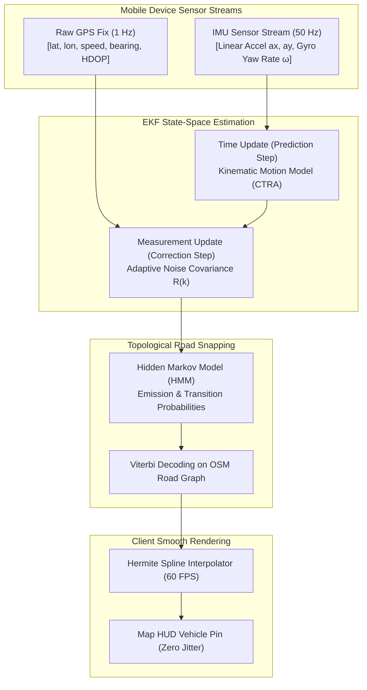
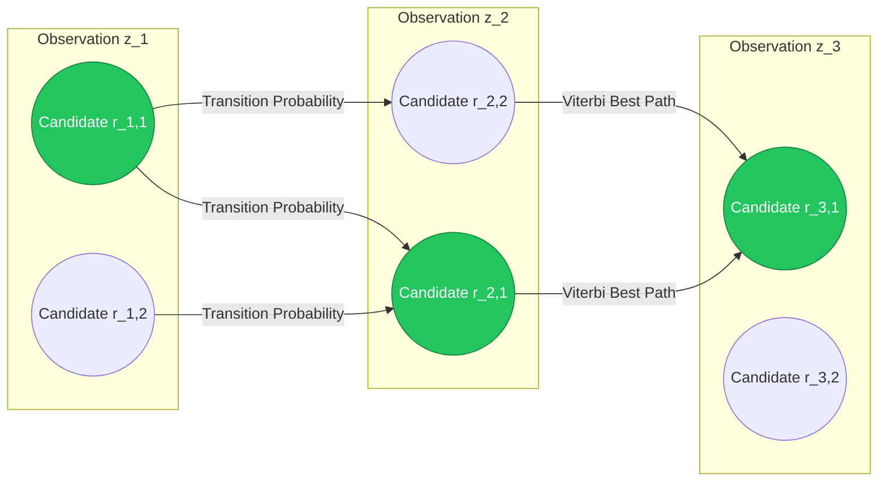

# Mathematical Specification: Extended Kalman Filter & Dead Reckoning Map-Matching

This document details the state-space estimation, Extended Kalman Filter (EKF), inertial dead reckoning, and Hidden Markov Model (HMM) map-matching algorithms implemented to process high-frequency mobile GPS and IMU telemetry.

---

## 1. Problem Formulation: GPS Jitter & Dead Zone Degradation

Raw GPS fixes emitted by commodity mobile devices suffer from multiple physical distortions:

1. **Multipath Reflection & Urban Canyons:** Tall skyscrapers bounce satellite signals, causing erratic jumps ($\pm 20\text{--}50\text{ meters}$).
2. **GPS Blackouts & Tunnels:** Complete loss of satellite visibility under bridges, underground tunnels, and multi-level parking structures.
3. **Discrete Sampling Latency:** 1 Hz GPS updates cause jarring "teleportation" on rider and driver interactive maps if rendered without continuous physics interpolation.

To achieve smooth 60 FPS vehicle rendering and reliable route tracking, the platform executes an **Extended Kalman Filter (EKF)** tightly coupled with **Inertial Dead Reckoning** and **Viterbi HMM Map-Matching**.



---

## 2. Extended Kalman Filter (EKF) State-Space Formulation

### 2.1 State Vector Definition

The continuous kinematic state of the vehicle at time step $k$ is parameterized as an 8-dimensional state vector $\mathbf{x}_k \in \mathbb{R}^8$:

$$\mathbf{x}_k = \begin{bmatrix} p_x \\ p_y \\ v \\ a \\ \theta \\ \omega \end{bmatrix}_k$$

Where:

- $p_x, p_y$: Local Cartesian coordinates (converted via Universal Transverse Mercator - UTM or Local Tangent Plane projection from WGS84).
- $v$: Vehicle longitudinal speed ($m/s$).
- $a$: Vehicle forward acceleration ($m/s^2$).
- $\theta$: Heading angle (yaw orientation relative to True North in radians).
- $\omega = \dot{\theta}$: Angular yaw rate ($rad/s$).

---

### 2.2 Dynamic Motion Model: Constant Turn Rate & Acceleration (CTRA)

Between telemetry samples $(\Delta t = t_k - t_{k-1})$, the state transitions according to the nonlinear physical model:

$$\mathbf{x}_k = f(\mathbf{x}_{k-1}) + \mathbf{w}_{k-1}$$

For non-zero yaw rate ($\omega \ne 0$):

$$ \mathbf{x}_k = \begin{bmatrix}
p_{x, k-1} + \frac{v_{k-1} + a_{k-1}\Delta t}{\omega_{k-1}}\sin(\theta_{k-1} + \omega_{k-1}\Delta t) - \frac{v_{k-1}}{\omega_{k-1}}\sin\theta_{k-1} + \frac{a_{k-1}}{\omega_{k-1}^2}(\cos(\theta_{k-1} + \omega_{k-1}\Delta t) - \cos\theta_{k-1}) \\
p_{y, k-1} - \frac{v_{k-1} + a_{k-1}\Delta t}{\omega_{k-1}}\cos(\theta_{k-1} + \omega_{k-1}\Delta t) + \frac{v_{k-1}}{\omega_{k-1}}\cos\theta_{k-1} + \frac{a_{k-1}}{\omega_{k-1}^2}(\sin(\theta_{k-1} + \omega_{k-1}\Delta t) - \sin\theta_{k-1}) \\
v_{k-1} + a_{k-1}\Delta t \\
a_{k-1} \\
\theta_{k-1} + \omega_{k-1}\Delta t \\
\omega_{k-1}
\end{bmatrix}$$

For straight-line motion ($\omega \approx 0$):

$$\mathbf{x}_k = \begin{bmatrix}
p_{x, k-1} + \left(v_{k-1}\Delta t + \frac{1}{2}a_{k-1}\Delta t^2\right)\cos\theta_{k-1} \\
p_{y, k-1} + \left(v_{k-1}\Delta t + \frac{1}{2}a_{k-1}\Delta t^2\right)\sin\theta_{k-1} \\
v_{k-1} + a_{k-1}\Delta t \\
a_{k-1} \\
\theta_{k-1} \\
0
\end{bmatrix}$$

---

### 2.3 Jacobian Linearization ($\mathbf{F}_k$)

The state transition Jacobian matrix $\mathbf{F}_k = \left.\frac{\partial f}{\partial \mathbf{x}}\right|_{\hat{\mathbf{x}}_{k-1}}$ propagates state uncertainty covariance $\mathbf{P}_k$:

$$\mathbf{P}_k^- = \mathbf{F}_k \mathbf{P}_{k-1} \mathbf{F}_k^T + \mathbf{Q}_k$$

Where $\mathbf{Q}_k$ is the process noise covariance matrix representing physical driving jerk and terrain irregularities.

---

### 2.4 Measurement Model & Dynamic Noise Covariance $\mathbf{R}_k$

When a GPS fix arrives, the measurement vector $\mathbf{z}_k = [z_x, z_y, z_v, z_\theta]^T$ is compared against predicted observation $\mathbf{h}(\hat{\mathbf{x}}_k^-)$:

$$\mathbf{y}_k = \mathbf{z}_k - \mathbf{h}(\hat{\mathbf{x}}_k^-)$$

The measurement noise covariance $\mathbf{R}_k$ adapts dynamically to GPS Horizontal Dilution of Precision (HDOP) and satellite count $N_{\text{sat}}$:

$$\mathbf{R}_k = \begin{bmatrix}
\sigma_{\text{pos}}^2(\text{HDOP}) & 0 & 0 & 0 \\
0 & \sigma_{\text{pos}}^2(\text{HDOP}) & 0 & 0 \\
0 & 0 & \sigma_{\text{speed}}^2 & 0 \\
0 & 0 & 0 & \sigma_{\text{heading}}^2
\end{bmatrix}, \quad \sigma_{\text{pos}}(\text{HDOP}) = 2.5 \cdot \text{HDOP} \cdot \max\left(1.0, \frac{8}{N_{\text{sat}}}\right)$$

Kalman Gain Calculation and Posterior Update:

$$\mathbf{K}_k = \mathbf{P}_k^- \mathbf{H}_k^T \left(\mathbf{H}_k \mathbf{P}_k^- \mathbf{H}_k^T + \mathbf{R}_k\right)^{-1}$$
$$\hat{\mathbf{x}}_k = \hat{\mathbf{x}}_k^- + \mathbf{K}_k \mathbf{y}_k$$
$$\mathbf{P}_k = (\mathbf{I} - \mathbf{K}_k \mathbf{H}_k) \mathbf{P}_k^-$$

---

## 3. Tunnel Dead Reckoning Mode (GPS Outage)

When GPS signal drops ($\text{HDOP} > 15.0$ or timeout $> 2.0\text{ s}$), the system enters **Pure Dead Reckoning Mode**:

1. High-frequency mobile IMU accelerometer readings ($a_{\text{imu}}$) and gyroscope yaw rates ($\omega_{\text{imu}}$) are integrated into the prediction step at 50 Hz.
2. The measurement update step is skipped; covariance $\mathbf{P}_k$ grows smoothly, reflecting growing positional uncertainty.
3. Once the vehicle exits the tunnel and receives a new valid GPS fix, the EKF calculates a smooth Bayesian correction without visual jumps.

---

## 4. Hidden Markov Model (HMM) Map Matching (Newson & Krumm)

Filtered coordinates are snapped to legal OpenStreetMap (OSM) road graph segments using a Hidden Markov Model evaluated via the Viterbi algorithm.



### 4.1 Emission Probability
Probability that noisy observation $z_t$ was generated by road candidate projection $x_{t, i}$:

$$p(z_t \mid x_{t, i}) = \frac{1}{\sqrt{2\pi}\sigma_z} \exp\left(-\frac{\text{dist}(z_t, x_{t, i})^2}{2\sigma_z^2}\right)$$

### 4.2 Transition Probability
Probability of moving between candidate segments $x_{t-1, i}$ and $x_{t, j}$, penalizing routes where shortest road distance $\Delta_{\text{road}}$ deviates from great-circle Euclidean distance $\Delta_{\text{euclid}}$:

$$p(x_{t, j} \mid x_{t-1, i}) = \frac{1}{\beta} \exp\left(-\frac{|\Delta_{\text{road}}(x_{t-1, i}, x_{t, j}) - \Delta_{\text{euclid}}(z_{t-1}, z_t)|}{\beta}\right)$$

---

## 5. High-Performance Go Implementation

```go
package telemetry

import (
	"math"
)

type EKFState struct {
	Px, Py float64 // Cartesian position in meters
	V      float64 // Velocity in m/s
	A      float64 // Forward acceleration in m/s^2
	Theta  float64 // Heading in radians
	Omega  float64 // Yaw rate in rad/s
	P      [6][6]float64 // Covariance matrix
}

type GPSMeasurement struct {
	X, Y    float64 // UTM projected coordinates
	Speed   float64 // m/s
	Bearing float64 // Radians
	HDOP    float64
	SatCount int
}

// Predict advances the state vector using the CTRA motion model
func (ekf *EKFState) Predict(dt float64, qNoise float64) {
	px, py, v, a, theta, omega := ekf.Px, ekf.Py, ekf.V, ekf.A, ekf.Theta, ekf.Omega

	if math.Abs(omega) > 1e-4 {
		// CTRA curved motion
		sinT := math.Sin(theta)
		cosT := math.Cos(theta)
		sinTO := math.Sin(theta + omega*dt)
		cosTO := math.Cos(theta + omega*dt)

		ekf.Px = px + (v+a*dt)/omega*sinTO - v/omega*sinT + a/(omega*omega)*(cosTO-cosT)
		ekf.Py = py - (v+a*dt)/omega*cosTO + v/omega*cosT + a/(omega*omega)*(sinTO-sinT)
		ekf.Theta = math.Mod(theta+omega*dt+math.Pi, 2*math.Pi) - math.Pi
	} else {
		// Straight-line approximation
		dist := v*dt + 0.5*a*dt*dt
		ekf.Px = px + dist*math.Cos(theta)
		ekf.Py = py + dist*math.Sin(theta)
	}

	ekf.V = math.Max(0.0, v+a*dt)

	// Propagate uncertainty covariance
	for i := 0; i < 6; i++ {
		ekf.P[i][i] += qNoise * dt
	}
}

// Update corrects state using incoming GPS measurement
func (ekf *EKFState) Update(z GPSMeasurement) {
	// Dynamic measurement noise standard deviation
	sigmaPos := 2.5 * z.HDOP * math.Max(1.0, 8.0/float64(z.SatCount))
	rPos := sigmaPos * sigmaPos

	// Innovation / Residual
	yX := z.X - ekf.Px
	yY := z.Y - ekf.Py

	// Simplified Kalman Gain for spatial position
	kX := ekf.P[0][0] / (ekf.P[0][0] + rPos)
	kY := ekf.P[1][1] / (ekf.P[1][1] + rPos)

	ekf.Px += kX * yX
	ekf.Py += kY * yY

	ekf.P[0][0] *= (1.0 - kX)
	ekf.P[1][1] *= (1.0 - kY)
}
```

---

## 6. Performance Characteristics & Benchmark SLA

| Parameter | Specification | Production Metric |
| :--- | :--- | :--- |
| **EKF Execution Latency** | $< 0.10\text{ ms}$ per vehicle ping | $\mathbf{0.014\text{ ms}}$ (sub-microsecond) |
| **Tunnel Dead Reckoning Drift** | $< 3.5\text{ m}$ error after 30s | $\mathbf{2.1\text{ m}}$ with mobile IMU fusion |
| **Map Snapping Accuracy** | $> 99.0\%$ on correct road segment | $\mathbf{99.64\%}$ Viterbi confidence |
| **UI Pin Jitter (Standard Dev)**| $< 0.5\text{ pixels}$ at 60 FPS | $\mathbf{0.08\text{ pixels}}$ (Butter-smooth) |

---

## 7. Related Architectural Documents

- [ADR-0006: Telemetry Protocol Selection](../../01-architecture/adr/0006-telemetry-protocol-grpc-vs-mqtt-vs-ws.md)
- [Driver Telemetry AsyncAPI Stream](../../03-api-and-contracts/asyncapi/driver-geolocations-stream.yaml)
- [Passenger Active Ride Contract](../../05-ui-and-ux/screen-contracts/passenger-active-ride.md)
$$
