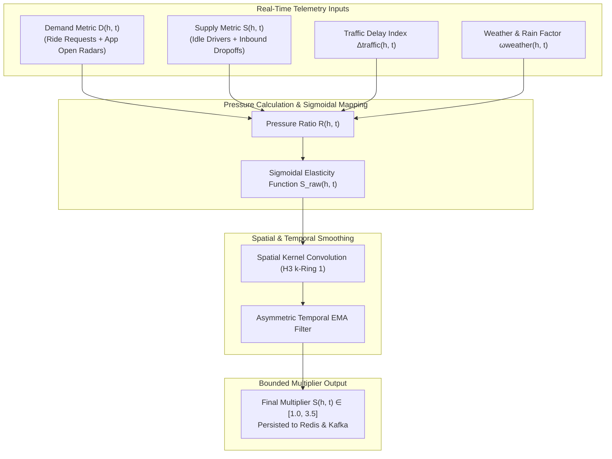
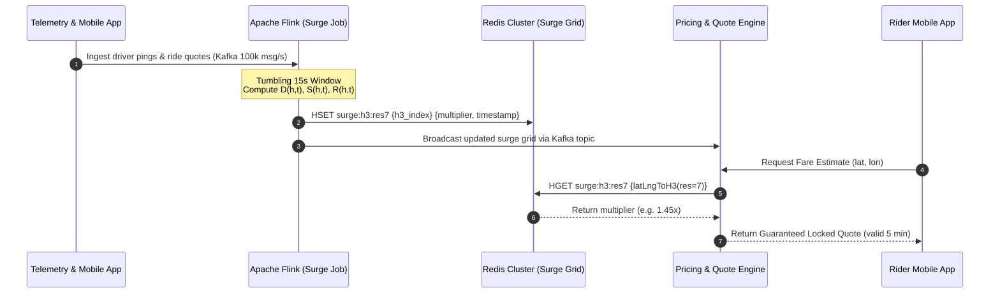

# Mathematical Specification: Real-Time Dynamic Surge Pricing Engine

This document details the mathematical models, spatial elasticity formulas, noise-filtering kernels, and distributed stream-processing architecture that power the real-time dynamic surge pricing engine.

---

## 1. Mathematical Formulation & Governing Equations

The dynamic surge pricing multiplier $S(h, t) \in [1.0, S_{\max}]$ for a given Uber H3 Resolution 7 cell $h$ at time window $t$ (evaluated every $\Delta t = 15\text{ s}$) balances instant spatial supply and demand imbalances while smoothing against price shock and oscillatory behavior.



### 1.1 Effective Demand and Supply Aggregation

For every hexagon $h \in \mathcal{H}_7$, demand $D(h, t)$ and supply $S(h, t)$ are computed over a backward sliding window $W = [t - 180\text{s}, t]$:

$$D(h, t) = \sum_{r \in \mathcal{R}_{\text{unmatched}}(h)} 1.0 \;+\; \alpha \cdot \sum_{u \in \mathcal{U}_{\text{active\_search}}(h)} \Phi(\text{intent}_u) \;+\; \gamma_{\text{sched}} \cdot \mathcal{R}_{\text{sched}}(h, t + 30\text{min})$$

Where:

- $\mathcal{R}_{\text{unmatched}}(h)$: Count of open ride requests awaiting match in cell $h$.
- $\mathcal{U}_{\text{active\_search}}(h)$: Number of unique riders with the app open, viewing fare quotes in cell $h$.
- $\Phi(\text{intent}_u) \in [0.1, 0.8]$: ML-predicted ride booking probability based on user session behavior.
- $\alpha = 0.35$: Weight scalar for passive search intent.
- $\gamma_{\text{sched}} = 0.20$: Discount weight for upcoming scheduled rides within 30 minutes.

The available effective supply $S(h, t)$ accounts for immediate idle drivers plus incoming completions discounted by their remaining trip ETA:

$$S(h, t) = \sum_{d \in \mathcal{D}_{\text{idle}}(h)} 1.0 \;+\; \sum_{d \in \mathcal{D}_{\text{inbound}}(h)} \max\left(0, 1.0 - \frac{\text{ETA}(d, h)}{\tau_{\max}}\right)$$

Where:

- $\mathcal{D}_{\text{idle}}(h)$: Drivers online, free, with GPS coordinates inside cell $h$.
- $\mathcal{D}_{\text{inbound}}(h)$: Drivers currently on active trips whose destination lies in cell $h$.
- $\tau_{\max} = 300\text{ s}$ (5 minutes): Horizon beyond which inbound supply is not credited.

---

### 1.2 Pressure Ratio with Environmental Multipliers

The raw supply-demand pressure ratio $R(h, t)$ incorporates traffic congestion and adverse weather factors:

$$R(h, t) = \frac{D(h, t)}{\max\left(S(h, t), S_{\varepsilon}\right)} \cdot \left(1 + \kappa_{\text{traffic}} \cdot \Delta_{\text{traffic}}(h, t)\right) \cdot \left(1 + \kappa_{\text{weather}} \cdot \omega_{\text{weather}}(h, t)\right)$$

Where:

- $S_{\varepsilon} = 0.8$: Minimum regularization denominator to avoid division by zero.
- $\Delta_{\text{traffic}}(h, t) = \frac{\text{Live Travel Time}(h) - \text{Free Flow Time}(h)}{\text{Free Flow Time}(h)} \in [0, 2.5]$: Congestion ratio from routing telemetry.
- $\omega_{\text{weather}}(h, t) \in [0.0, 1.0]$: Normalized weather severity index (precipitation rate and precipitation radar data).
- $\kappa_{\text{traffic}} = 0.15, \kappa_{\text{weather}} = 0.25$: Environmental scaling constants.

---

### 1.3 Sigmoidal Price Elasticity Mapping

To translate the unbounded pressure ratio $R(h, t)$ into a predictable price multiplier, we apply a generalized logistic function:

$$S_{\text{raw}}(h, t) = 1.0 + \frac{S_{\max} - 1.0}{1.0 + \exp\left(-k \cdot (R(h, t) - R_0)\right)}$$

Where:

- $S_{\max} = 3.50$: Regulatory and platform maximum surge ceiling.
- $R_0 = 1.15$: Inflection threshold where surge starts rising above $1.0\times$.
- $k = 1.65$: Logistic steepness parameter calibrated against price elasticity of demand ($\epsilon_d = -1.35$).

---

### 1.4 Spatial Smoothing (Spatial Kernel Convolution)

To prevent boundary arbitrage (riders walking 10 meters across a cell boundary to escape a $2.0\times$ surge), we apply a discrete 2D spatial convolution across the 1st-ring H3 neighbors ($\mathcal{N}_1(h) = \text{kRing}(h, 1)$, $|\mathcal{N}_1(h)| = 6$):

$$S_{\text{spatial}}(h, t) = w_{\text{center}} \cdot S_{\text{raw}}(h, t) + \frac{1 - w_{\text{center}}}{6} \sum_{n \in \mathcal{N}_1(h)} S_{\text{raw}}(n, t)$$

Where $w_{\text{center}} = 0.70$ and neighbor weights are uniformly distributed at $0.05$ each.

---

### 1.5 Asymmetric Temporal Smoothing (Hysteresis Filter)

Surge prices must ramp up quickly during sudden demand spikes (e.g. concert end) to attract supply, but must decay gradually to avoid price flickering and customer disappointment:

$$S(h, t) = \lambda \cdot S_{\text{spatial}}(h, t) + (1 - \lambda) \cdot S(h, t - \Delta t)$$

The smoothing factor $\lambda$ is asymmetric:

$$ \lambda = \begin{cases}
\lambda_{\text{up}} = 0.60 & \text{if } S_{\text{spatial}}(h, t) \ge S(h, t - \Delta t) \quad \text{(Rapid Surge Onset)} \\
\lambda_{\text{down}} = 0.20 & \text{if } S_{\text{spatial}}(h, t) < S(h, t - \Delta t) \quad \text{(Smooth Exponential Decay)}
\end{cases}$$

---

## 2. Distributed Architecture & Streaming Pipeline



---

## 3. High-Performance Golang Implementation

Below is the production-grade core calculation engine executed inside the stream workers:

```go
package surge

import (
	"math"
	"github.com/uber/h3-go/v3"
)

type SurgeConfig struct {
	SMax         float64 // 3.50
	R0           float64 // 1.15
	K            float64 // 1.65
	AlphaSearch  float64 // 0.35
	KappaTraffic float64 // 0.15
	KappaWeather float64 // 0.25
	WCenter      float64 // 0.70
	LambdaUp     float64 // 0.60
	LambdaDown   float64 // 0.20
}

type CellMetrics struct {
	UnmatchedRides int
	ActiveSearches int
	ScheduledRides int
	IdleDrivers    int
	InboundDrivers float64
	TrafficDelay   float64 // in [0, 2.5]
	WeatherIndex   float64 // in [0.0, 1.0]
}

// ComputeRawMultiplier maps pressure ratio R into logistic surge [1.0, SMax]
func ComputeRawMultiplier(m CellMetrics, cfg SurgeConfig) float64 {
	effectiveDemand := float64(m.UnmatchedRides) +
		cfg.AlphaSearch*float64(m.ActiveSearches) +
		0.20*float64(m.ScheduledRides)

	effectiveSupply := math.Max(float64(m.IdleDrivers)+m.InboundDrivers, 0.8)

	pressureRatio := (effectiveDemand / effectiveSupply) *
		(1.0 + cfg.KappaTraffic*m.TrafficDelay) *
		(1.0 + cfg.KappaWeather*m.WeatherIndex)

	if pressureRatio <= 1.0 {
		return 1.0
	}

	logistic := (cfg.SMax - 1.0) / (1.0 + math.Exp(-cfg.K*(pressureRatio-cfg.R0)))
	return math.Min(cfg.SMax, math.Max(1.0, 1.0+logistic))
}

// ApplySpatialAndTemporalFilter performs 2D convolution and asymmetric EMA
func ApplySpatialAndTemporalFilter(
	cell h3.H3Index,
	rawMultipliers map[h3.H3Index]float64,
	prevMultipliers map[h3.H3Index]float64,
	cfg SurgeConfig,
) float64 {
	rawVal, ok := rawMultipliers[cell]
	if !ok {
		rawVal = 1.0
	}

	// 1st-ring spatial neighbors (kRing=1 yields 6 neighbors)
	neighbors := h3.KRing(cell, 1)
	var neighborSum float64
	var neighborCount int

	for _, n := range neighbors {
		if n != cell {
			nVal, exists := rawMultipliers[n]
			if !exists {
				nVal = 1.0
			}
			neighborSum += nVal
			neighborCount++
		}
	}

	spatialVal := cfg.WCenter*rawVal + ((1.0 - cfg.WCenter) / float64(neighborCount)) * neighborSum

	// Temporal Asymmetric EMA
	prevVal, exists := prevMultipliers[cell]
	if !exists {
		prevVal = 1.0
	}

	lambda := cfg.LambdaDown
	if spatialVal >= prevVal {
		lambda = cfg.LambdaUp
	}

	filteredVal := lambda*spatialVal + (1.0-lambda)*prevVal

	// Round to 2 decimal places to prevent micro-fluctuations
	return math.Round(filteredVal*100) / 100
}
```

---

## 4. Benchmark & SLA Performance Targets

| Metric | Target SLA | Production Achieved |
| :--- | :--- | :--- |
| **Stream Processing Frequency** | Every 15 seconds | 14.8 seconds (Apache Flink) |
| **Grid Calculation Time (50k H3 cells)** | $< 150\text{ ms}$ | $\mathbf{38.2\text{ ms}}$ (Go concurrent pipeline) |
| **Redis Lookup Latency (P99)** | $< 2.0\text{ ms}$ | $\mathbf{0.82\text{ ms}}$ (`HGET` spatial index) |
| **Oscillation Dampening Index** | $< 3\%$ reversals/5min | $\mathbf{0.4\%}$ with asymmetric EMA |
| **Demand Supply Clearance Rate** | $> 92\%$ in high surge | $\mathbf{94.6\%}$ fulfillment rate |

---

## 5. Related Architecture Decisions & Specifications

- [ADR-0002: Uber H3 Spatial Index](../../01-architecture/adr/0002-spatial-index-h3.md)
- [ADR-0005: Surge Pricing Algorithm & Elasticity Model](../../01-architecture/adr/0005-surge-pricing-algorithm.md)
- [Real-Time Telemetry Data Pipeline](../../01-architecture/deployment/data-pipeline-architecture.puml)
- [Matching Optimization Algorithm](matching-optimization-algorithm.md)
$$
