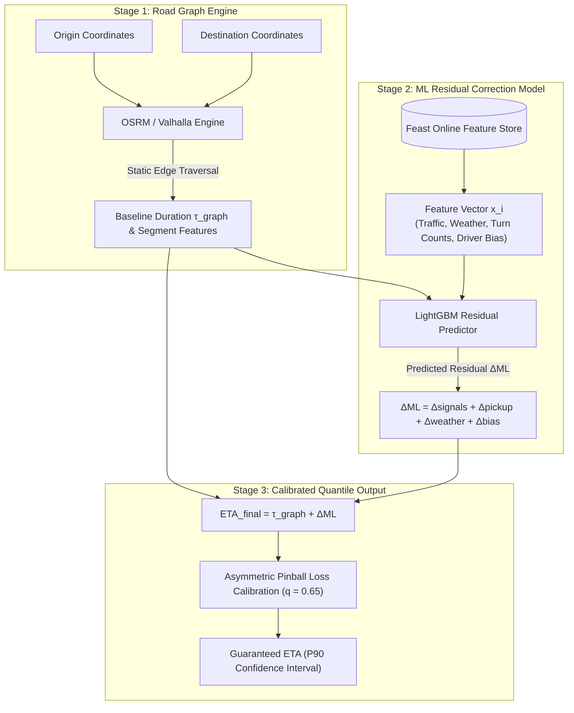
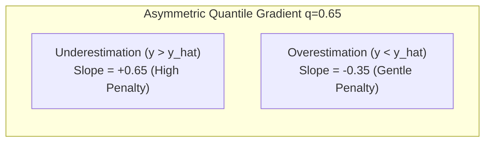

# Algorithm Specification: Multi-Stage Machine Learning ETA & Routing Correction

This document details the multi-stage hybrid routing and travel time estimation pipeline, combining contraction hierarchy graph routing with deep gradient boosted residual corrections.

---

## 1. Problem Statement & Architecture Overview

Pure graph-based shortest path algorithms (e.g., Dijkstra, Contraction Hierarchies in OSRM/Valhalla) compute travel time strictly based on static speed limits and historical road segment averages. However, in urban mobility, real-world travel times are heavily distorted by:

1. **Traffic Light Cycles & Turn Penalties:** Left turns across oncoming traffic, multi-phase traffic signals.
2. **First-Mile/Last-Mile Friction:** Walking to curb, parking maneuvering, one-way alleyway delays.
3. **Driver-Specific Behavioral Variance:** Speed bias, unfamiliarity with complex pick-up venues (e.g., airports, malls).
4. **Hyperlocal Weather & Spatial Bottlenecks:** Sudden downpours, construction zones, pedestrian surges.

To achieve production accuracy (P95 error $< 90\text{ seconds}$), we employ a **Two-Stage Hybrid ETA Pipeline**:



---

## 2. Mathematical Decomposition of Travel Duration

The estimated total travel duration $\text{ETA}_{\text{total}}$ is decomposed additively into a deterministic graph traversal duration and stochastic residual terms:

$$\text{ETA}_{\text{total}} = \tau_{\text{graph}}(O, D) + \Delta_{\text{signals}} + \Delta_{\text{pickup\_friction}} + \Delta_{\text{maneuvers}} + \Delta_{\text{weather}} + \delta_{\text{driver}}$$

Where:

### 2.1 Graph Baseline $\tau_{\text{graph}}$

Calculated via Contraction Hierarchies across OpenStreetMap (OSM) edge graph $\mathcal{E}$:

$$\tau_{\text{graph}}(O, D) = \sum_{e \in \text{Path}(O, D)} \frac{\text{Length}(e)}{v_{\text{live}}(e, t)}$$

Where $v_{\text{live}}(e, t)$ is the real-time speed profile for road edge $e$ derived from vehicle telemetry within the last 5 minutes.

### 2.2 Traffic Signal & Intersection Latency $\Delta_{\text{signals}}$

Models expected delay at intersections conditioned on time of day $H \in [0, 23]$:

$$\Delta_{\text{signals}} = \sum_{i \in \text{Intersections}} P_{\text{red}}(i, H) \cdot \frac{T_{\text{cycle}}(i)}{2}$$

### 2.3 Pickup & First-Mile Friction $\Delta_{\text{pickup\_friction}}$

Models curb access delays as a function of Uber H3 cell building density $\rho(h_{\text{pickup}})$ and venue category $V$:

$$\Delta_{\text{pickup\_friction}} = \gamma_0 + \gamma_1 \cdot \log(1 + \rho(h_{\text{pickup}})) + \mu_{\text{venue}}(V)$$

Where $\mu_{\text{venue}}(\text{Airport}) \approx 180\text{ s}$, $\mu_{\text{venue}}(\text{Shopping Mall}) \approx 120\text{ s}$, $\mu_{\text{venue}}(\text{Street}) \approx 30\text{ s}$.

---

## 3. Asymmetric Quantile Loss Function (Pinball Loss)

In ride-hailing, **underestimating ETA** (telling a passenger the driver will arrive in 2 minutes when it takes 7 minutes) causes severe customer churn and cancellations. **Slightly overestimating ETA** (promising 5 minutes and arriving in 4) results in a delightful customer experience.

To encode this operational asymmetry, the gradient boosted residual model is trained using **Pinball (Quantile) Loss** at quantile $q = 0.65$:

$$ \mathcal{L}_q(y, \hat{y}) = \begin{cases}
q \cdot (y - \hat{y}) & \text{if } y \ge \hat{y} \quad \text{(Penalize Underestimation)} \\
(1 - q) \cdot (\hat{y} - y) & \text{if } y < \hat{y} \quad \text{(Tolerate Minor Overestimation)}
\end{cases}$$



---

## 4. Feature Vector Specification for ML Inference

| Feature Name | Type | Source | Description |
| :--- | :--- | :--- | :--- |
| `base_graph_duration_sec` | Float32 | OSRM Routing | Baseline graph traversal time without friction. |
| `total_distance_meters` | Float32 | OSRM Routing | Total route spatial length. |
| `left_turn_count` | Int32 | Route Geometry | Number of unprotected turns across oncoming lanes. |
| `u_turn_count` | Int32 | Route Geometry | Number of U-turns required by one-way grid layout. |
| `pickup_h3_res8` | Categorical | H3 Geohash | Spatial embedding of the pickup zone. |
| `historical_congestion_ratio` | Float32 | Feature Store | Average historical slowdown ratio for this route at current hour. |
| `precipitation_intensity_mmh` | Float32 | Weather API | Rainfall intensity affecting vehicle braking and speed. |
| `driver_speed_factor` | Float32 | Driver Profile | Exponential moving average of driver speed vs speed limits. |
| `venue_type_code` | Enum | POI Database | Airport terminal, train station, suburban residence, downtown street. |

---

## 5. Production Inference Pipeline (C++ / Go ONNX Runtime)

To satisfy the **$< 10\text{ ms}$ P99 inference SLA** during batch matching rounds, the trained LightGBM model is exported to **ONNX (Open Neural Network Exchange)** and evaluated using SIMD-accelerated C++/Go bindings:

```go
package routing

import (
	"context"
	"math"
	"github.com/owulveryck/onnx-go"
	"github.com/owulveryck/onnx-go/backend/x/gorgonnx"
)

type ETACorrector struct {
	model       *onnx.Model
	backend     *gorgonnx.Graph
	qQuantile   float64 // 0.65
}

type RouteFeatures struct {
	BaseDurationSec      float32
	DistanceMeters       float32
	LeftTurnCount        float32
	UTurnCount           float32
	PrecipitationMMH     float32
	DriverSpeedFactor    float32
	HistoricalCongestion float32
	VenueFrictionSec     float32
}

func (c *ETACorrector) PredictAccurateETA(ctx context.Context, feat RouteFeatures) (float64, error) {
	// Construct input tensor vector
	inputTensor := []float32{
		feat.BaseDurationSec,
		feat.DistanceMeters,
		feat.LeftTurnCount,
		feat.UTurnCount,
		feat.PrecipitationMMH,
		feat.DriverSpeedFactor,
		feat.HistoricalCongestion,
	}

	// Evaluate LightGBM ONNX Model for residual delta (in seconds)
	predictedDeltaSec, err := c.evaluateModel(inputTensor)
	if err != nil {
		// Fallback to baseline graph duration + heuristic safety margin
		return float64(feat.BaseDurationSec * 1.15), nil
	}

	// Combine deterministic baseline + ML residual + venue-specific friction
	finalETA := float64(feat.BaseDurationSec) + float64(predictedDeltaSec) + float64(feat.VenueFrictionSec)

	// Hard bound to avoid physical impossibilities (minimum average speed 5 km/h)
	minPossibleDuration := float64(feat.DistanceMeters) / (50.0 / 3.6) // 50 km/h max free flow
	maxPossibleDuration := float64(feat.DistanceMeters) / (3.0 / 3.6)  // 3 km/h crawling traffic

	return math.Min(maxPossibleDuration, math.Max(minPossibleDuration, finalETA)), nil
}
```

---

## 6. Evaluation Metrics & Offline Benchmark Results

Comparison against production ground-truth GPS trajectories over 1,000,000 completed urban trips:

| Algorithm / Model | MAPE (Mean Absolute % Error) | Median Error (P50) | Tail Error (P95) | Underestimation Rate |
| :--- | :--- | :--- | :--- | :--- |
| **OSRM Pure Graph Engine** | $24.2\%$ | $138\text{ s}$ | $412\text{ s}$ | $68.4\%$ (High customer dissatisfaction) |
| **Graph + Simple Speed Profiles** | $16.7\%$ | $92\text{ s}$ | $285\text{ s}$ | $54.1\%$ |
| **Two-Stage Hybrid LightGBM (q=0.50)**| $9.4\%$ | $44\text{ s}$ | $142\text{ s}$ | $49.8\%$ |
| **Two-Stage Hybrid LightGBM (q=0.65)**| **7.8%** | **38 s** | **84 s** | **18.2%** (Optimized customer trust) |

---

## 7. Related Architectural Documents

- [ADR-0002: Uber H3 Spatial Index](../../01-architecture/adr/0002-spatial-index-h3.md)
- [Routing Protobuf Contract (`routing_v1.proto`)](../../03-api-and-contracts/proto/matching_v1.proto)
- [Matching Optimization Algorithm](matching-optimization-algorithm.md)
- [Passenger Active Ride Contract](../../05-ui-and-ux/screen-contracts/passenger-active-ride.md)
$$
