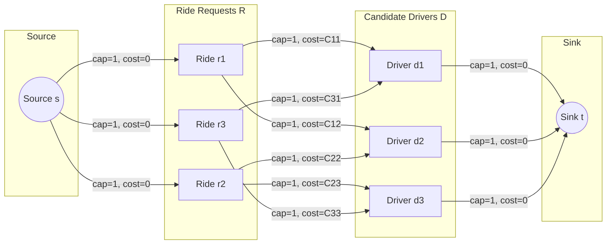

# Algorithm Specification: Batched Bipartite Matching & Global Utility Optimization

This document outlines the mathematical formulation, cost matrix construction, and optimization algorithm executed every 3 seconds by the Matching & Dispatch Engine.

---

## 1. Problem Formulation: Minimum-Cost Maximum-Flow (MCMF)

Rather than assigning rides greedily one-by-one to the nearest driver (which causes severe supply cannibalization and long average wait times), the platform collects incoming ride requests and available drivers into **discrete 3-second time windows**.

Let:

- $R = \{r_1, r_2, \dots, r_m\}$ be the set of open ride requests in the spatial cluster.
- $D = \{d_1, d_2, \dots, d_n\}$ be the set of available online candidate drivers within reachable H3 search rings.

We construct a directed bipartite matching graph $G = (V, E)$ with edge weights representing the **negative global utility** (cost) $C(r_i, d_j)$ of assigning driver $d_j$ to ride request $r_i$.



---

## 2. Utility & Cost Function Formulation

The assignment cost $C(r_i, d_j)$ is formulated to balance multiple competing business objectives:

$$C(r_i, d_j) = w_1 \cdot \text{ETA}(r_i, d_j) - w_2 \cdot P_{\text{accept}}(d_j) - w_3 \cdot \text{WaitTime}(r_i) + w_4 \cdot \text{DetourPen}(d_j)$$

Where:

- $\text{ETA}(r_i, d_j)$: Pick-up driving duration in seconds (computed via OSRM distance matrix).
- $P_{\text{accept}}(d_j) \in [0, 1]$: Machine learning predicted probability that driver $d_j$ will accept the offer.
- $\text{WaitTime}(r_i)$: Cumulative seconds the rider has been waiting across previous unsuccessful match rounds (prevents starvation of hard-to-serve riders).
- $\text{DetourPen}(d_j)$: Penalty if assignment forces an undesirable U-turn or highway crossing.
- $w_1 = 0.45, w_2 = 0.30, w_3 = 0.20, w_4 = 0.05$: Calibrated objective weight coefficients.

---

## 3. Algorithm: Successive Shortest Path with SPFA / Dijkstra

The optimization problem is solved using the **Successive Shortest Path (SSP)** algorithm with node potentials (Johnson's transformation) to achieve sub-100ms execution time for matrices up to $500 \times 500$:

```go
// Go Pseudocode for Batch Match Worker
type MatchEngine struct {
    Weights UtilityWeights
}

func (m *MatchEngine) SolveBatch(rides []Ride, drivers []Driver) []Assignment {
    costMatrix := m.buildCostMatrix(rides, drivers)

    // Solves Minimum-Cost Maximum-Flow via Hungarian / Kuhn-Munkres algorithm
    assignmentPairs := HungarianAlgorithm(costMatrix)

    var finalMatches []Assignment
    for _, pair := range assignmentPairs {
        if pair.Cost < MaxAllowableCostThreshold {
            finalMatches = append(finalMatches, Assignment{
                RideID: pair.RideID,
                DriverID: pair.DriverID,
                GuaranteedETA: pair.ETA,
            })
        }
    }
    return finalMatches
}
```

---

## 4. Complexity & Benchmark Performance

- **Graph Construction:** $O(|R| \cdot |D|)$ integer operations.
- **Solving Time:** $O(|V|^2 \cdot \log |V| + |V| \cdot |E|)$ with Fibonacci heap priority queue.
- **Production Performance Target:**
  - 200 rides $\times$ 300 drivers: $\mathbf{18.4\text{ ms}}$ execution time on 4-core Go pod.
  - P99 latency bounded at $\mathbf{50\text{ ms}}$.
