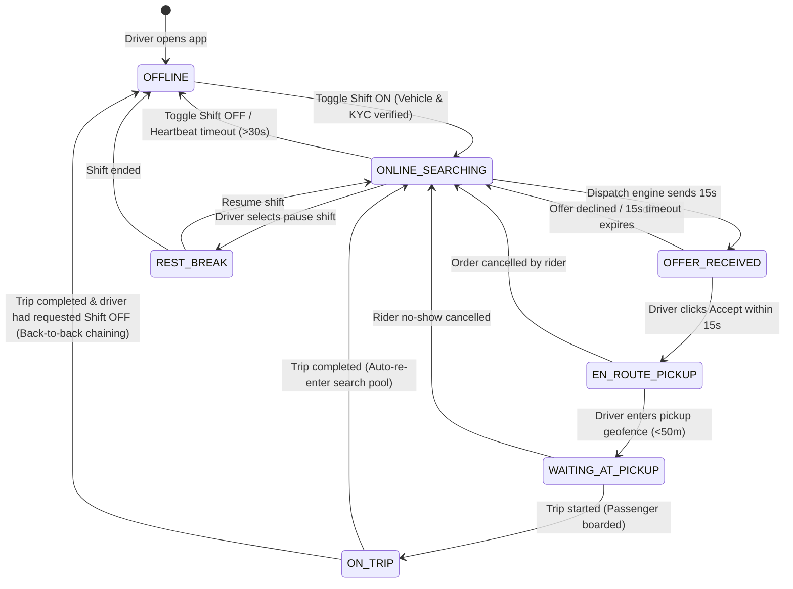

# Finite State Machine: Driver Status & Shift Lifecycle

This document defines the lifecycle states, heartbeat requirements, and transition triggers for driver partners operating on the platform.

---

## 1. Driver State Transition Diagram

---

## 2. Driver State Catalog

| State               | Redis In-Memory Index                              | Description                                                                        | GPS Telemetry Cadence |
| :------------------ | :------------------------------------------------- | :--------------------------------------------------------------------------------- | :-------------------- |
| `OFFLINE`           | Not in H3 driver sets                              | Driver is not working. No telemetry required.                                      | Inactive              |
| `ONLINE_SEARCHING`  | Stored in `h3_drivers:{res8_cell}`                 | Available for dispatch. Continuously indexed for radar views.                      | 1 update / 2 sec      |
| `OFFER_RECEIVED`    | Temporarily soft-locked (`SETNX lock:driver:{id}`) | Evaluating a 15-second ride offer. Temporarily excluded from other matching rings. | 1 update / 1 sec      |
| `EN_ROUTE_PICKUP`   | Tagged as `BUSY_ASSIGNED`                          | Navigating to rider pickup point. Position streamed to rider.                      | 1 update / 1 sec      |
| `WAITING_AT_PICKUP` | Tagged as `WAITING`                                | Stationary at pickup point. Geofence dwell timer ticking.                          | 1 update / 2 sec      |
| `ON_TRIP`           | Tagged as `ON_TRIP`                                | Carrying passenger to destination. Map-matched trajectory logged.                  | 1 update / 1 sec      |
| `REST_BREAK`        | Excluded from dispatch                             | Temporary break mode (max 45 min per shift).                                       | Inactive / 30 sec     |

---

## 3. Heartbeat & Liveness Protocol

To prevent ghost drivers in the matching engine:

- Every driver app must maintain an active WebSocket / gRPC stream.
- **Liveness Invariant:** If no coordinate update is received for $\mathbf{30\text{ seconds}}$, the backend automatically:
  1. Removes the driver from the active Redis H3 spatial sets.
  2. Sets driver status to `OFFLINE (Connection Lost)`.
  3. Publishes `driver.disconnected` event to Kafka.
