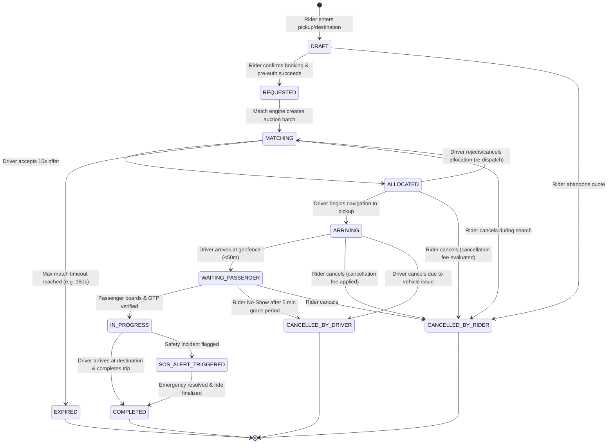

# Finite State Machine: Order & Trip Lifecycle

This document defines the formal state transitions, invariants, triggers, and timeout behaviors governing the life of a ride request.

---

## 1. State Transition Diagram

---

## 2. Formal State Definitions

| State Name            | Description                                                                      | Active Actions / Invariants                                                                   | Allowed Next States                                                  |
| :-------------------- | :------------------------------------------------------------------------------- | :-------------------------------------------------------------------------------------------- | :------------------------------------------------------------------- |
| `DRAFT`               | Temporary quote session with route estimation and frozen price token.            | Token TTL: 120 seconds. No hold placed on payment method yet.                                 | `REQUESTED`, `CANCELLED_BY_RIDER`                                    |
| `REQUESTED`           | Payment pre-authorization hold confirmed by PSP.                                 | Order event emitted to Kafka (`order.requested`).                                             | `MATCHING`, `CANCELLED_BY_RIDER`                                     |
| `MATCHING`            | Matching engine queries H3 rings and evaluates driver acceptance probabilities.  | Active 15s offer countdowns. Expands search ring if drivers decline.                          | `ALLOCATED`, `EXPIRED`, `CANCELLED_BY_RIDER`                         |
| `ALLOCATED`           | Driver accepted offer. Match lock acquired in Redis.                             | Driver coordinates stream to rider app via WebSocket.                                         | `ARRIVING`, `MATCHING`, `CANCELLED_BY_RIDER`                         |
| `ARRIVING`            | Driver is physically traveling toward rider's pickup location.                   | Real-time ETA calculated every 10s. Route snapping active.                                    | `WAITING_PASSENGER`, `CANCELLED_BY_RIDER`, `CANCELLED_BY_DRIVER`     |
| `WAITING_PASSENGER`   | Driver arrived at pickup geofence ($< 50\text{m}$).                              | Free waiting countdown (3 min) followed by paid waiting per-minute billing.                   | `IN_PROGRESS`, `CANCELLED_BY_DRIVER` (No-show), `CANCELLED_BY_RIDER` |
| `IN_PROGRESS`         | Rider boarded. Vehicle in transit to destination.                                | Telemetry recorded to ClickHouse trajectory log.                                              | `COMPLETED`, `SOS_ALERT_TRIGGERED`                                   |
| `SOS_ALERT_TRIGGERED` | Emergency button triggered by rider or driver.                                   | Audio stream recorded, Safety response team alerted, live telemetry broadcast to authorities. | `COMPLETED`                                                          |
| `COMPLETED`           | Destination reached. Final fare recalculated (actual distance + time + waiting). | Capture payment hold, post journal entries to ledger, prompt rating.                          | Final Terminal State                                                 |
| `CANCELLED_BY_RIDER`  | Rider aborted order.                                                             | Calculate cancellation fee based on arrival time elapsed; release/refund hold.                | Final Terminal State                                                 |
| `CANCELLED_BY_DRIVER` | Driver cancelled due to passenger no-show or vehicle issue.                      | If rider no-show, charge standard no-show fee to rider and credit driver.                     | Final Terminal State                                                 |
| `EXPIRED`             | No driver accepted within maximum auction limit (180s).                          | Void payment pre-authorization hold; notify rider with option to retry with surge/tip.        | Final Terminal State                                                 |

---

## 3. Transition Rules & Invariants

1. **Idempotent Transitions:** Every transition requires the `current_state` and `order_id` in an atomic database `UPDATE ... WHERE id = :id AND status = :expected_state`.
2. **Cancellation Fee Invariant:**
   - If Rider cancels $\le 2\text{ minutes}$ after driver allocation: **No fee charged**.
   - If Rider cancels $> 2\text{ minutes}$ after driver allocation or when driver has arrived: **Cancellation Fee Charged** to compensate driver deadhead travel.
3. **No-Show Rule:** Driver can only trigger `CANCELLED_BY_DRIVER` with reason `NO_SHOW` if GPS confirms driver remained inside pickup geofence for $\ge 5\text{ continuous minutes}$.
