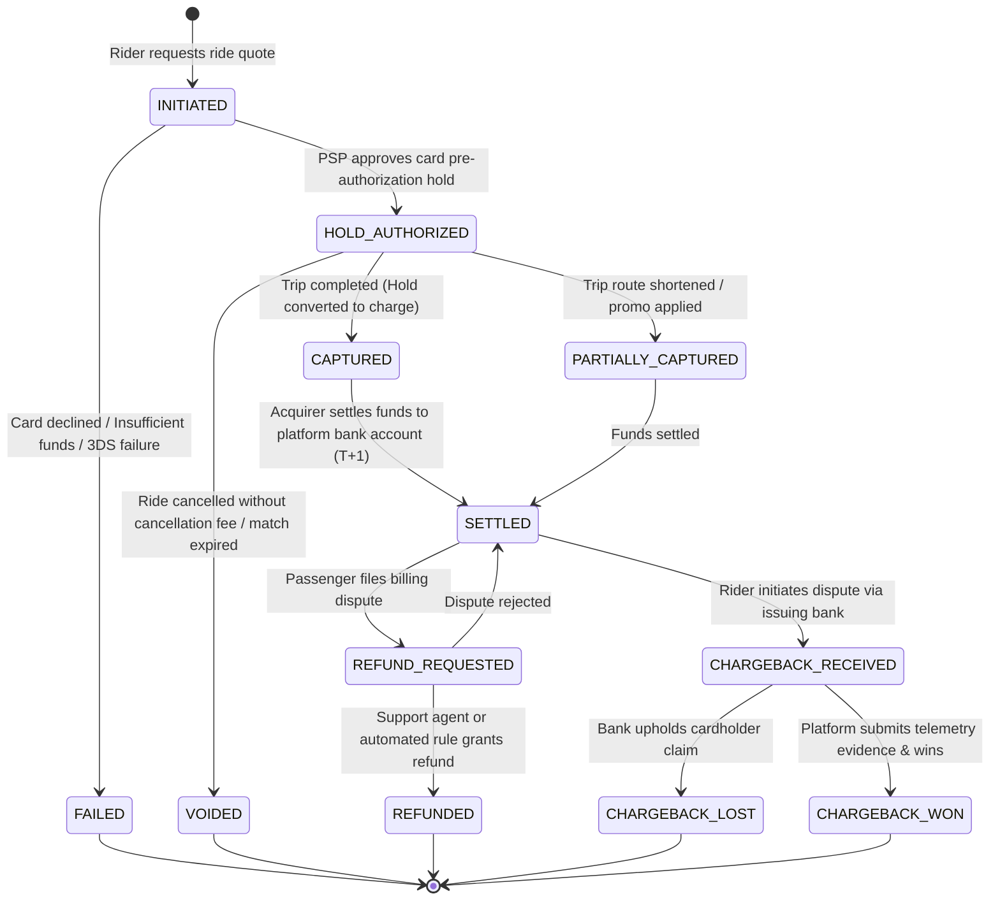

# Finite State Machine: Payment & Settlement Lifecycle

This document defines the payment transaction states, pre-authorization holds, charge capture rules, and dispute refund transitions.

---

## 1. Payment State Transition Diagram

---

## 2. Formal State Catalog & Actions

| State                 | PSP Status         | Double-Entry Ledger Impact                                                        | Description                                                                |
| :-------------------- | :----------------- | :-------------------------------------------------------------------------------- | :------------------------------------------------------------------------- |
| `INITIATED`           | `created`          | None                                                                              | Initial transaction record generated before calling PSP.                   |
| `HOLD_AUTHORIZED`     | `requires_capture` | None (Escrow memo only)                                                           | Pre-auth hold placed on rider's card for estimated amount $+ 15\%$ buffer. |
| `CAPTURED`            | `succeeded`        | **Debit:** Rider Card Asset **Credit:** Passenger Settlement Pending           | Final fare captured immediately upon ride completion.                      |
| `PARTIALLY_CAPTURED`  | `succeeded`        | Same as Captured for adjusted amount; remainder released.                         | Captured when final fare is less than authorized hold.                     |
| `VOIDED`              | `canceled`         | None                                                                              | Pre-auth hold released without charging customer.                          |
| `SETTLED`             | `settled`          | **Debit:** Platform Cash Bank **Credit:** Platform Revenue & Driver Payable    | Funds cleared into platform bank account.                                  |
| `REFUND_REQUESTED`    | `in_review`        | Memo hold                                                                         | Dispute ticket opened under review.                                        |
| `REFUNDED`            | `refunded`         | **Debit:** Platform Revenue / Driver Earnings **Credit:** Rider Balance Refund | Refund posted to rider's card.                                             |
| `CHARGEBACK_RECEIVED` | `dispute_opened`   | Dispute escrow reserve                                                            | Formal bank chargeback notification received.                              |
| `CHARGEBACK_LOST`     | `dispute_lost`     | Chargeback fee deduction ($15-$25) + Loss recognized                              | Final dispute loss.                                                        |

---

## 3. Financial Invariant Rules

1. **Pre-Authorization Buffer:** For estimated rides with tolls/traffic variability, the authorized hold is calculated as:
   $$\text{Authorized Amount} = \text{Estimated Fare} \times 1.15$$
2. **Capture Within 7 Days:** Card network regulations mandate that card holds must be captured or released within 7 calendar days.
3. **Double-Entry Balance Rule:** A payment transition cannot transition to `CAPTURED` without an atomic PostgreSQL commit of the journal entries in `ledger_entries`.
