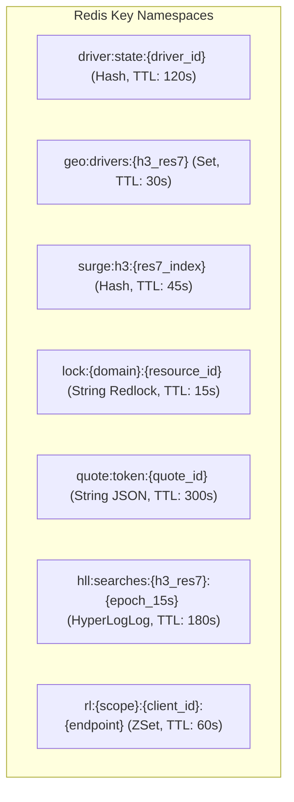
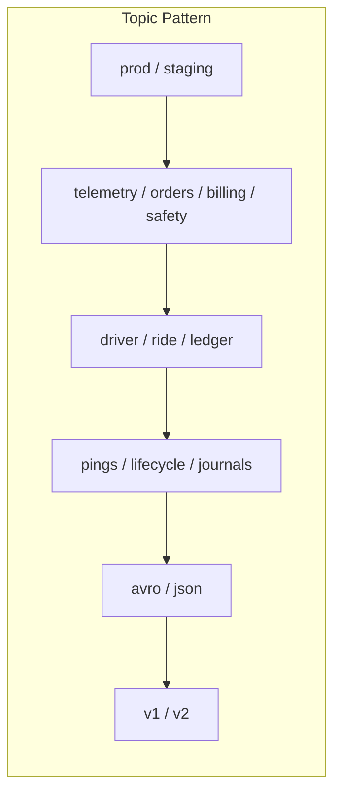

# Enterprise Data Contracts & Distributed Key Naming Standards

This document establishes the binding architectural standards for caching keys, in-memory data structures, streaming event topics, and schema governance across the platform.

---

## 1. Redis Key Space & In-Memory Data Structures

All keys stored in Redis must follow strict lowercase, colon-delimited hierarchical namespaces with bounded TTLs to ensure memory safety.

### 1.1 Key Specification Registry

| Namespace Pattern                | Redis Type | Default TTL    | Description & Fields                                                                                                |
| :------------------------------- | :--------- | :------------- | :------------------------------------------------------------------------------------------------------------------ |
| `driver:state:{driver_id}`       | `HASH`     | $120\text{ s}$ | Real-time driver telemetry state: `lat`, `lon`, `bearing`, `speed`, `status`, `vehicle_id`, `tariff`, `updated_at`. |
| `geo:drivers:{h3_res7}`          | `SET`      | $30\text{ s}$  | Set of active driver IDs physically located within the H3 Resolution 7 cell.                                        |
| `surge:h3:{h3_res7}`             | `HASH`     | $45\text{ s}$  | Multiplier cache: `multiplier` (e.g. 1.45), `ratio`, `demand`, `supply`, `epoch`.                                   |
| `quote:token:{quote_token}`      | `STRING`   | $300\text{ s}$ | Serialized JSON guaranteed fare quote provided to passenger app.                                                    |
| `lock:dispatch:{ride_id}`        | `STRING`   | $15\text{ s}$  | Distributed mutual exclusion lock for dispatching driver offers.                                                    |
| `lock:driver:{driver_id}`        | `STRING`   | $15\text{ s}$  | Lock ensuring driver cannot receive multiple simultaneous offers.                                                   |
| `hll:searches:{h3_res7}:{epoch}` | `HLL`      | $180\text{ s}$ | HyperLogLog cardinality tracker for unique riders opening app radars.                                               |
| `rl:ip:{ip_address}:{route}`     | `ZSET`     | $60\text{ s}$  | Sliding window log rate limiter for API gateway DDoS protection.                                                    |
| `queue:scheduled:{city_id}`      | `ZSET`     | No TTL         | Sorted set of advance scheduled rides keyed by Unix timestamp score.                                                |

### 1.2 Memory Eviction & Operational Policies

- **Eviction Policy:** `volatile-lru` (Evict keys with an explicit TTL when maxmemory is approached).
- **Critical Keys (No Eviction):** `queue:scheduled:*` and persistent distributed locks are isolated to a dedicated Redis cluster with `noeviction` policy.
- **Serialization Standard:** MessagePack / Protobuf binary serialization for large objects; flat Hashes for field-level atomic reads.

---

## 2. Apache Kafka Topic Naming & Partitioning Standards

Kafka topics follow the canonical enterprise format:

$$\mathbf{<\text{env}>.<\text{domain}>.<\text{entity}>.<\text{event\_type}>.<\text{format}>.v<\text{major\_version}>}$$

### 2.1 Core Topic Catalog

| Topic Name                              | Partition Key | Cleanup Policy   | Retention | Target Consumer Groups                      |
| :-------------------------------------- | :------------ | :--------------- | :-------- | :------------------------------------------ |
| `prod.telemetry.driver.snapped.json.v1` | `driver_id`   | `delete`         | 24 Hours  | Location Ingestion, Flink Surge Engine      |
| `prod.orders.ride.lifecycle.json.v1`    | `ride_id`     | `delete`         | 7 Days    | Trip Tracker, Push Gateway, Billing Service |
| `prod.billing.ledger.journals.avro.v1`  | `journal_id`  | `compact,delete` | 365 Days  | Ledger Accounting, Financial Reporting      |
| `prod.pricing.surge.grid.json.v1`       | `h3_res7`     | `delete`         | 2 Hours   | Edge Redis Caches, Passenger App Stream     |
| `prod.safety.telemetry.alerts.json.v1`  | `ride_id`     | `delete`         | 30 Days   | Trust & Safety Operations, PSAP Dispatch    |
| `prod.b2b.corporate.webhooks.json.v1`   | `tenant_id`   | `delete`         | 3 Days    | Outbound Webhook Delivery Worker            |

### 2.2 Partitioning & Ordering Invariants

1. **Ordering per Entity:** By using `driver_id` or `ride_id` as the message key, Kafka guarantees strict FIFO ordering within each partition.
2. **Surge Grid Partitioning:** Keyed by `h3_res7` hash modulo, ensuring localized spatial computations process in the same worker thread.
3. **Replication & Reliability Parameters:**
   - `replication.factor = 3`
   - `min.insync.replicas = 2`
   - `acks = all` (producer waits for full quorum persistence before acknowledging).

---

## 3. Schema Evolution & Governance (Schema Registry)

For all mission-critical billing and telemetry events, **Apache Avro** and **Protobuf** schemas are strictly registered in the Confluent Schema Registry.

- **Compatibility Mode:** `BACKWARD` (New schema can read records written with previous schema version).
- **Rules:**
  1. Default values must be provided for all new fields.
  2. Fields cannot be removed without a major version bump (`.v2`).
  3. CI/CD automated pipeline rejects commits that fail schema compatibility checks.

---

## 4. Related Domain & Architecture References

- [PostgreSQL Core Schema DDL](sql-ddl/001_core_schema.sql)
- [PostgreSQL Billing Ledger DDL](sql-ddl/002_billing_ledger_schema.sql)
- [ClickHouse Telemetry DDL](sql-ddl/003_clickhouse_telemetry_schema.sql)
- [Domain Dictionary (Glossary)](domain-dictionary.md)
- [ADR-0001: Kafka Event Bus](../../01-architecture/adr/0001-use-kafka-for-events.md)
- [ADR-0007: Redis Distributed Locking](../../01-architecture/adr/0007-redis-distributed-locking-strategy.md)
