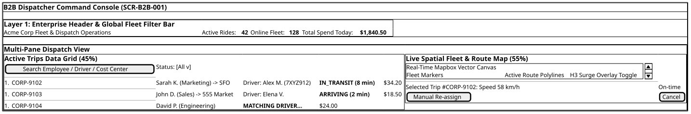

# Screen Contract: B2B Dispatcher Monitoring Board (`SCR-B2B-001`)

This specification defines the multi-pane real-time web console used by enterprise dispatchers and fleet managers.

---

## 1. Visual Multi-Pane Web Console Architecture



> _Source: [diagrams/b2b-dispatch-board.puml](diagrams/b2b-dispatch-board.puml)_


---

## 2. Real-Time Synchronization Protocol

- **Connection:** Web browser establishes an SSE (Server-Sent Events) or WebSocket connection to:
  `wss://b2b.mobility-platform.io/v1/stream?tenant_id={tenant_id}&token={jwt}`
- **Delta Sync Invariant:**
  - Initial load fetches snapshot via `GET /api/v1/corporate/rides/active`.
  - Ongoing mutations arrive as incremental JSON patches (`OP: UPDATE`, `OP: INSERT`, `OP: DELETE`).

---

## 3. Real-Time Dispatch Event Payload

```json
{
  "op": "UPDATE",
  "booking_id": "CORP-9102",
  "status": "IN_TRANSIT",
  "driver_id": "drv_3381",
  "driver_name": "Alex Miller",
  "vehicle_plate": "7XYZ912",
  "eta_minutes": 8,
  "current_coordinates": {
    "lat": 37.7812,
    "lng": -122.411
  },
  "current_spend_amount": 34.2
}
```
