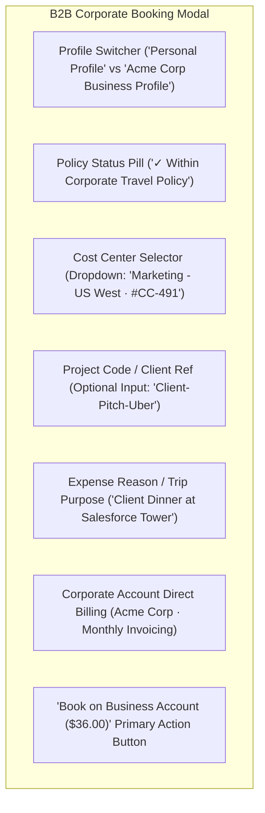

# Screen Contract: B2B Employee Policy & Ride Booking (`SCR-B2B-003`)

This specification defines the corporate employee booking modal within the passenger app, enforcement of corporate travel policies, cost center assignment, budget limits, and automated corporate expense accounting.

---

## 1. UI Components & Visual Layout



### 1.1 Policy Enforcement Invariants

- **Permitted Hours:** e.g., 07:00 AM – 10:00 PM on weekdays (or 24/7 if approved executive).
- **Geofencing:** Allowed origins/destinations within corporate branch office radius.
- **Maximum Fare Cap:** Auto-flags or requires manager pre-approval if single fare exceeds $\$100.00$.

---

## 2. Corporate Booking Request (`POST /api/v1/b2b/rides/create`)

```json
{
  "employee_user_id": "usr_emp_4412",
  "corporate_account_id": "corp_acme_9001",
  "cost_center_id": "cc_marketing_us_west",
  "project_reference": "Q3-PROMO-CAMPAIGN",
  "trip_purpose": "Client meeting at Salesforce Tower",
  "quote_id": "qte_99381b10a",
  "selected_tariff": "comfort"
}
```
