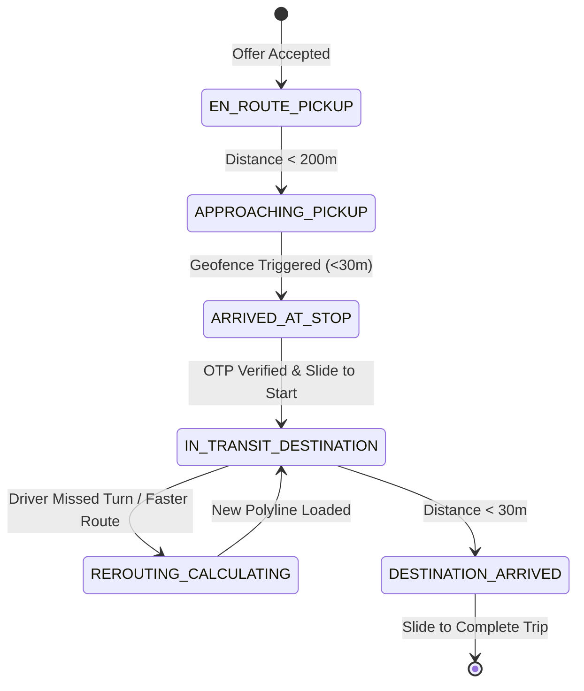

# Screen Contract: Driver Turn-by-Turn Active Navigation (`SCR-DRV-004`)

This specification defines the driver in-app turn-by-turn navigation HUD, maneuver guidance banners, lane guidance, dynamic rerouting, and toll indicators.

---

## 1. Visual UI Layout & Multi-Layer Hierarchy

```mermaid
flowchart TB
    subgraph TerminalFrame ["📱 Driver Mobile Terminal · Active Navigation HUD (SCR-DRV-004)"]
        direction TB

        subgraph TopManeuverHUD ["Layer 1: Top Maneuver Guidance Banner (Dark Glassmorphism)"]
            TurnIcon["↗️ <b>In 250 m</b> · Exit 431A to SFO Airport"]
            NextManeuver["↪️ Then turn left on Domestic Terminals in 100m"]
            LaneGuidance["🛣️ Lane Guidance: [✖] [✖] [<b>🟢</b>] [<b>🟢</b>] (Stay in 2 Right Lanes)"]
        end

        subgraph Map3DCanvas ["Layer 0: 3D Perspective Map Canvas (Heading Up)"]
            NavPolyline["🗺️ Active Turn-by-Turn Route Polyline · Live Snapped Vehicle Arrow"]
            SpeedLimitHUD["⚡ Speed: <b>62 km/h</b> (Limit: 65 km/h) · 🌉 Toll: $5.00 Ahead"]
        end

        subgraph BottomTripSheet ["Layer 2: Trip Progress & Control Sheet"]
            direction TB
            subgraph StatusRow ["Trip Metrics & ETA"]
                Metrics["⏱️ <b>12 min</b> remaining · <b>4.8 km</b> · ETA <b>17:45</b>"]
                RerouteBtn["⚡ Faster route found (-4 min) · [Accept]"]
            end

            subgraph ActionGestures ["Driver Completion Action"]
                SlideComplete["🟩 <b>SLIDE TO COMPLETE TRIP >>>>>>>>></b> (Swipe Right)"]
                SOSBtn["🚨 Floating Emergency SOS Button"]
            end
        end
    end

    style TerminalFrame fill:#0F172A,stroke:#334155,stroke-width:3px
    style TopManeuverHUD fill:#1E293B,stroke:#0EA5E9,stroke-width:2px
    style TurnIcon fill:#0284C7,stroke:#0369A1,color:#FFFFFF,stroke-width:1px
    style NextManeuver fill:#334155,stroke:#475569,color:#CBD5E1,stroke-width:1px
    style LaneGuidance fill:#0F172A,stroke:#10B981,color:#FFFFFF,stroke-width:1px
    style Map3DCanvas fill:#0284C7,stroke:#0369A1,stroke-width:2px
    style BottomTripSheet fill:#1E293B,stroke:#475569,stroke-width:2px
    style StatusRow fill:#0F172A,stroke:#334155,color:#FFFFFF,stroke-width:1px
    style SlideComplete fill:#10B981,stroke:#047857,color:#FFFFFF,stroke-width:2px
    style SOSBtn fill:#EF4444,stroke:#991B1B,color:#FFFFFF,stroke-width:1px
```




### 1.1 Header Maneuver HUD

- **Top Maneuver Card:** Dark glassmorphism banner (`#0F172A`, 90% opacity).
  - Next Turn Glyphs: Sharp vector icons (Turn Left, Hard Right, Highway Exit, U-Turn, Roundabout 2nd Exit).
  - Distance Countdown: Dynamic high-visibility bold font (e.g. `250 m` or `50 ft`).
  - Street Name: Primary road text (`Market St / Pine St`).
  - Secondary Next-Next Maneuver: Sub-banner (`Then turn left on 4th St in 100m`).

### 1.2 Lane Guidance & Highway Junction Visualizer

- Multi-lane indicator showing active lane choices at complex junctions.
- Recommended lane highlighted in Emerald Green (`#10B981`); non-recommended lanes dimmed in Slate (`#64748B`).

### 1.3 Toll Road & Alternative Reroute Overlay

- **Toll Indicator Pill:** Displays upcoming bridge/highway toll fees (`$6.50 Toll`).
- **Dynamic Reroute Button:** Triggered when background traffic monitoring detects an alternative route faster by $\ge 3\text{ minutes}$ (`Faster route available: -4 min`).

### 1.4 Bottom Trip Control Sheet

- Current Step Label: `Heading to Pickup (Sarah)` or `In Transit to SFO Airport`.
- Remaining Duration & Distance: `14 min · 8.2 km · ETA 18:02`.
- Primary Slide-to-Confirm Widget: Prevents accidental tap while driving (`SLIDE TO COMPLETE TRIP`).

---

## 2. Navigation State Machine & Maneuver Transitions



---

## 3. Real-Time HUD State Contract Payload

```json
{
  "ride_id": "ride_99182a",
  "navigation_mode": "IN_TRANSIT_TO_DROPOFF",
  "target_destination": {
    "address": "San Francisco International Airport, Terminal 2",
    "latitude": 37.618817,
    "longitude": -122.375427
  },
  "current_maneuver": {
    "maneuver_id": "man_041",
    "turn_type": "HIGHWAY_EXIT_RIGHT",
    "distance_to_turn_meters": 240,
    "street_name": "Exit 431A to SFO Airport",
    "lane_guidance": {
      "total_lanes": 4,
      "recommended_lane_indices": [2, 3]
    }
  },
  "subsequent_maneuver": {
    "turn_type": "KEEP_LEFT",
    "street_name": "Domestic Terminals Lower Level"
  },
  "trip_metrics": {
    "remaining_duration_seconds": 780,
    "remaining_distance_meters": 11400,
    "estimated_arrival_time": "2026-08-16T18:15:00Z",
    "current_speed_kph": 62.4,
    "speed_limit_kph": 65.0,
    "toll_ahead": {
      "has_toll": true,
      "amount": 5.0,
      "currency": "USD"
    }
  }
}
```
