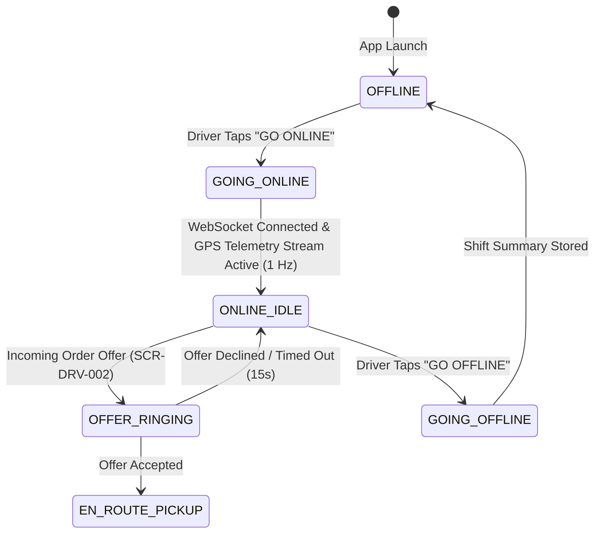

# Screen Contract: Driver Home & Surge Heatmap (`SCR-DRV-001`)

This specification defines the primary idle dashboard for driver partners, including shift status management (Offline / Online), real-time H3 hexagonal Surge Heatmaps, shift earnings summaries, quest progression, and destination filtering ("Drive Towards Home").

---

## 1. Visual UI Layout & Multi-Layer Hierarchy

> [!NOTE]
> **Vector UI Wireframe:** View the standalone vector screen mockup: [driver-home-dashboard.svg](../wireframes/driver-home-dashboard.svg) ([.puml source](../wireframes/driver-home-dashboard.puml)).

```mermaid
flowchart TB
    subgraph TerminalFrame ["📱 Driver Mobile Terminal · Home Dashboard (SCR-DRV-001)"]
        direction TB

        subgraph TopShiftBar ["Layer 1: Shift Control & Destination Mode"]
            OnlinePill["🟢 <b>● ONLINE (ACCEPTING RIDES)</b> · [Tap to Go Offline]"]
            DestFilter["🏠 Set Destination (Drive Towards Home · 1/2 Left)"]
        end

        subgraph MapCanvas ["Layer 0: Full-Screen H3 Hexagonal Surge Heatmap"]
            HexLayer["🗺️ H3 Res 7 Hexagons: Mission (⚡ 1.8x +$4.50) · Downtown (⚡ 1.4x)"]
        end

        subgraph BottomSheet ["Layer 2: Daily Earnings & Quest Progression Sheet"]
            direction TB
            subgraph EarningsCard ["Today's Financial Summary"]
                Earnings["💵 <b>$248.50</b> Earnings · 12 Rides · 6h 15m Online ($39.75/hr)"]
            end

            subgraph QuestBox ["Active Incentive Goal"]
                QuestBar["🎯 Quest: <b>12 / 15 Rides</b> (Complete 3 more for <b>+$45.00 Bonus</b>)"]
            end

            subgraph MetricsRow ["Driver Health & Account Metrics"]
                Stats["★ <b>4.96</b> Rating · <b>94%</b> Acceptance · <b>1.2%</b> Cancellation"]
            end
        end
    end

    style TerminalFrame fill:#F8FAFC,stroke:#1E293B,stroke-width:3px
    style TopShiftBar fill:#FFFFFF,stroke:#94A3B8,stroke-width:1px
    style OnlinePill fill:#ECFDF5,stroke:#059669,stroke-width:2px
    style DestFilter fill:#F8FAFC,stroke:#CBD5E1,stroke-width:1px
    style MapCanvas fill:#FEF3C7,stroke:#D97706,stroke-width:2px
    style BottomSheet fill:#FFFFFF,stroke:#475569,stroke-width:2px
    style EarningsCard fill:#EFF6FF,stroke:#3B82F6,stroke-width:1px
    style QuestBox fill:#F0FDF4,stroke:#16A34A,stroke-width:1px
    style MetricsRow fill:#F8FAFC,stroke:#E2E8F0,stroke-width:1px
```




### 1.1 Shift Online/Offline Toggle

- **Floating Status Pill:** High-contrast pill located at the top center.
  - **OFFLINE State:** Dark Gray (`#334155`), background map is dimmed. Tapping sends `DRIVER_SHIFT_ONLINE` event.
  - **ONLINE (WAITING FOR ORDERS):** Glowing Emerald Green (`#10B981`) with pulse animation and radar sweep.

### 1.2 H3 Hexagonal Surge Heatmap Layer

- Dynamically renders Uber H3 Resolution 7 hexagonal polygons over the map canvas.
- **Color Grading:**
  - $1.0\times - 1.2\times$: Transparent / Subtle blue outline.
  - $1.3\times - 1.6\times$: Yellow / Warm Amber (`#F59E0B`).
  - $1.7\times - 2.5\times+$: High-intensity Crimson Red (`#EF4444`) with flat bonus badge (`+$6.50`).
- Tapping any hexagon displays current demand volume, average ETA, and estimated surge bonus duration.

### 1.3 Destination Filter ("Driver Towards Home")

- Allows driver to set a preferred drop-off corridor (up to 2 times per day).
- Matching engine filters incoming dispatch offers to ensure marginal drop-off direction aligns with the specified destination ($\cos \theta \ge 0.70$).

---

## 2. Driver State Machine (Shift Lifecycle)



---

## 3. Communication Contract (WebSocket Surge Broadcast)

### Inbound Stream: `SURGE_HEATMAP_UPDATE`

```json
{
  "event": "SURGE_HEATMAP_UPDATE",
  "timestamp": "2026-08-16T14:20:00Z",
  "bounding_box": {
    "north": 37.812,
    "south": 37.701,
    "east": -122.35,
    "west": -122.52
  },
  "hexagons": [
    {
      "h3_index": "872830828ffffff",
      "surge_multiplier": 1.75,
      "surge_flat_bonus": 4.5,
      "demand_level": "VERY_HIGH"
    },
    {
      "h3_index": "87283082bffffff",
      "surge_multiplier": 1.3,
      "surge_flat_bonus": 0.0,
      "demand_level": "MODERATE"
    }
  ]
}
```
