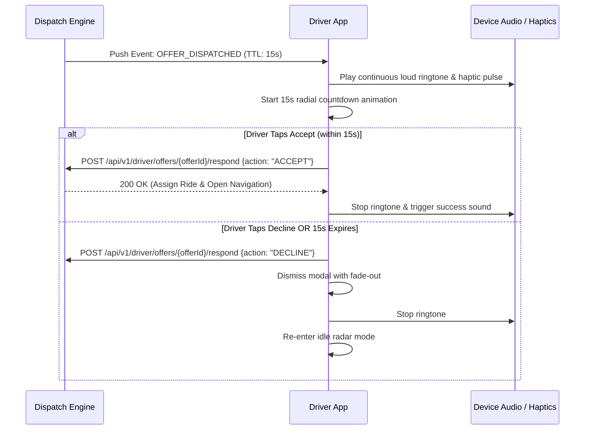

# Screen Contract: Driver Order Offer Modal (`SCR-DRV-003`)

This specification defines the high-urgency 15-second ride offer modal presented to an available driver partner.

---

## 1. Visual UI Layout & Multi-Layer Hierarchy

```mermaid
flowchart TB
    subgraph TerminalFrame ["📱 Driver Mobile Terminal · 15s Offer Modal (SCR-DRV-002)"]
        direction TB

        subgraph TopCountdownBar ["Layer 1: Radial Urgency Countdown (15s TTL)"]
            TimerDisplay["⏱️ <b>15s COUNTDOWN (Audio Chime Active)</b> · [✖ Decline Offer]"]
        end

        subgraph PayoutHeroCard ["Layer 2: Guaranteed Driver Payout Card"]
            Cash["💵 <size:20><b>$14.80 Payout</b></size><br/>⚡ <i>Includes 1.4x Surge (+$3.20)</i>"]
        end

        subgraph RouteMetricsCard ["Layer 3: Pickup & Trip Trajectory Details"]
            PickupInfo["📍 <b>Pickup (1.2 km · 3 min):</b> 450 Market St"]
            DropoffInfo["🏁 <b>Dropoff (7.2 km · 15 min):</b> Mission Bay Blvd S"]
            RiderInfo["👤 Passenger: Sarah (★ 4.92 · 180 trips)"]
        end

        subgraph BigActionZone ["Layer 4: High-Visibility Touch Target"]
            AcceptCTA["🟩 <size:18><b>ACCEPT OFFER (TAP TO CONFIRM)</b></size><br/><i>Auto-opens turn-by-turn navigation to pickup</i>"]
        end
    end

    style TerminalFrame fill:#0F172A,stroke:#334155,stroke-width:3px
    style TopCountdownBar fill:#FEF3C7,stroke:#D97706,stroke-width:2px
    style PayoutHeroCard fill:#ECFDF5,stroke:#059669,stroke-width:2px
    style RouteMetricsCard fill:#1E293B,stroke:#475569,color:#FFFFFF,stroke-width:1px
    style BigActionZone fill:#10B981,stroke:#047857,color:#FFFFFF,stroke-width:3px
    style AcceptCTA fill:#10B981,stroke:#047857,color:#FFFFFF,stroke-width:2px
```




---

## 2. Timing & Lock Lifecycle



---

## 3. Offer Payload Schema

```json
{
  "offer_id": "off_991823a",
  "ride_id": "ride_77218",
  "expires_at_unix_ms": 1771146435000,
  "timeout_seconds": 15,
  "payout": {
    "amount": 14.8,
    "currency": "USD",
    "surge_amount": 3.2
  },
  "pickup": {
    "address": "450 Market St",
    "distance_meters": 1200,
    "eta_seconds": 180
  },
  "dropoff": {
    "address": "Mission Bay Blvd S",
    "estimated_trip_duration_seconds": 900,
    "estimated_trip_distance_meters": 7200
  },
  "rider": {
    "first_name": "Sarah",
    "rating": 4.92
  }
}
```
