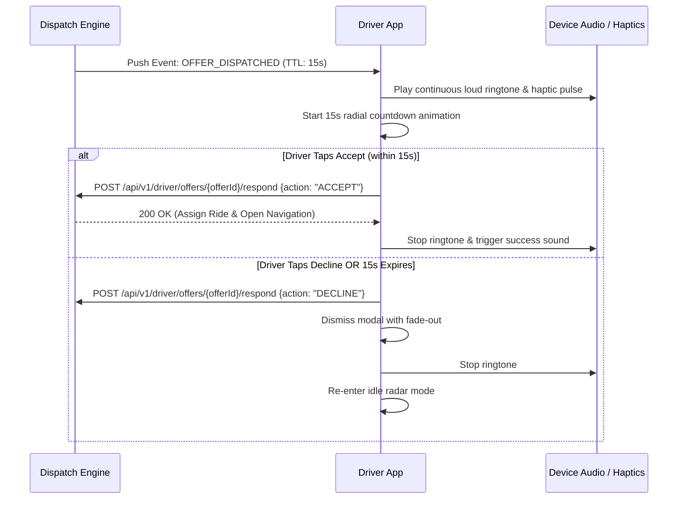

# Screen Contract: Driver Order Offer Modal (`SCR-DRV-003`)

This specification defines the high-urgency 15-second ride offer modal presented to an available driver partner.

---

## 1. UI Components & Layout

- **Header:** Full-width pulsating radial countdown timer ($15\text{s} \to 0\text{s}$) with audio chime.
- **Fare Highlight Card:**
  - Guaranteed Driver Payout: Large prominent green font (`$14.80`).
  - Surge Badge if applicable (e.g. `🔥 1.4x Surge included`).
- **Pickup & Trip Metrics:**
  - Pickup Distance & ETA: `1.2 km · 3 min away`.
  - Trip Destination: `Downtown Financial District · 7.2 km (15 min trip)`.
  - Rider Rating: `⭐ 4.92 (180 trips)`.
- **Primary Actions:**
  - Big Circular Touch Target: `ACCEPT OFFER` (Green `#16A34A`, haptic feedback).
  - Secondary Top-Right Close Button: `Decline` (Light grey `#64748B`).

---

## 2. Timing & Lock Lifecycle



---

## 3. Offer Payload Schema

```json
{
  "offer_id": "off_991823a",
  "ride_id": "ride_77218",
  "expires_at_unix_ms": 1771146435000,
  "timeout_seconds": 15,
  "payout": {
    "amount": 14.8,
    "currency": "USD",
    "surge_amount": 3.2
  },
  "pickup": {
    "address": "450 Market St",
    "distance_meters": 1200,
    "eta_seconds": 180
  },
  "dropoff": {
    "address": "Mission Bay Blvd S",
    "estimated_trip_duration_seconds": 900,
    "estimated_trip_distance_meters": 7200
  },
  "rider": {
    "first_name": "Sarah",
    "rating": 4.92
  }
}
```
