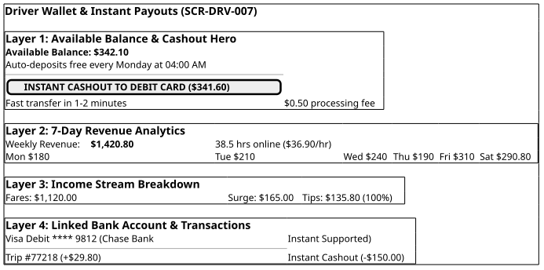

# Screen Contract: Driver Wallet & Instant Payouts (`SCR-DRV-007`)

This specification defines the driver financial wallet screen, real-time balance tracking, weekly revenue bar charts, transaction ledgers, and the Instant Payout transfer workflow.

---

## 1. Visual UI Layout & Multi-Layer Hierarchy



> _Source: [diagrams/driver-payout-and-wallet.puml](diagrams/driver-payout-and-wallet.puml)_


### 1.1 Balance & Instant Cashout

- **Available Balance:** Real-time net balance available for immediate withdrawal.
- **Instant Cashout Button:** Triggers real-time card push payment (via Stripe Custom / Adyen Payouts) with a flat $\$0.50$ processing fee.
- **Weekly Auto-Payout:** Un-withdrawn balances are automatically swept every Monday at 04:00 AM via ACH direct deposit free of charge.

### 1.2 Weekly Revenue Chart

- Interactive 7-day bar chart showing daily revenue, hours online, and net earnings per hour ($\$38.50/\text{hr}$).

---

## 2. Payout Request Contract (`POST /api/v1/payouts/instant`)

```json
{
  "driver_id": "drv_9921",
  "payout_amount": 342.1,
  "currency": "USD",
  "fee_amount": 0.5,
  "net_transfer_amount": 341.6,
  "destination_payment_method_id": "card_debit_9812",
  "idempotency_key": "pay_req_20260816_9921_001"
}
```
