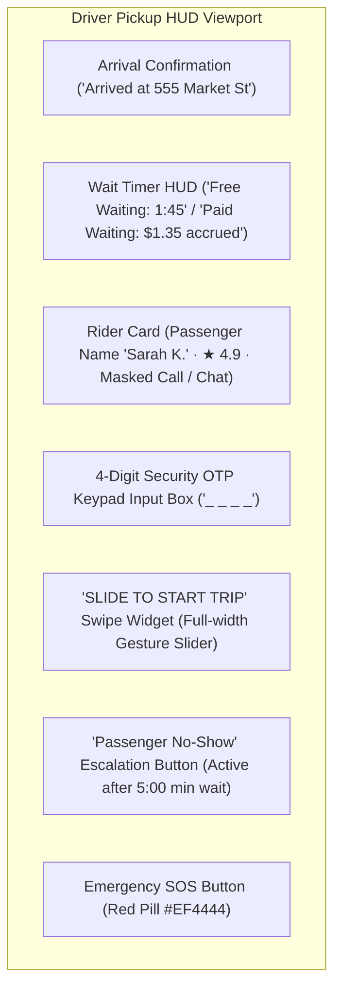
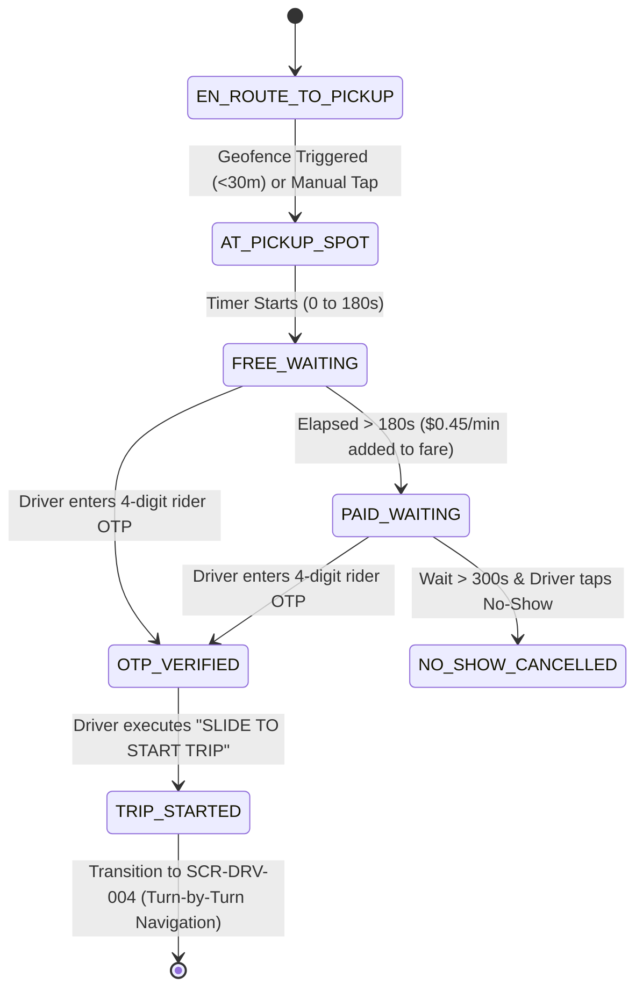

# Screen Contract: Driver Pickup Spot & Trip Start (`SCR-DRV-003`)

This specification defines the driver terminal behavior upon arriving at the rider's pickup location, including automatic/manual arrival triggering, waiting fee accounting, rider OTP entry & verification, and the swipeable `SLIDE TO START TRIP` gesture action.

---

## 1. UI Components & Visual Layout



### 1.1 Arrival Triggering & Geofence Sync

- **Automatic Geofence Trigger:** When driver's GPS location is within $\le 30\text{ meters}$ of the pickup coordinate for $\ge 5\text{ seconds}$, the system automatically sends `DRIVER_ARRIVED` and initiates the waiting timer.
- **Manual Override Button:** If GPS is degraded (e.g. underground parking / urban canyon), driver can tap `I Have Arrived` manually.

### 1.2 Dual-Stage Waiting Timer

- **Free Waiting Stage (0:00 to 3:00):** Displayed in green/slate. No additional fees charged to rider.
- **Paid Waiting Stage (> 3:00):** Counter turns Amber and dynamically counts accrued waiting revenue for the driver ($+\$0.45/\text{min}$).
- **No-Show Threshold (5:00):** After $5\text{ minutes}$ of verified on-site waiting and at least 1 attempted phone call, the `Cancel (Rider No-Show)` button activates, entitling driver to the guaranteed cancellation fee payout ($\$6.00$).

### 1.3 4-Digit Rider OTP Verification

- Driver asks passenger for the 4-digit OTP code shown on the rider's screen.
- On terminal keypad entry:
  - If valid: Haptic double-tap pulse + unlocking the `SLIDE TO START TRIP` gesture.
  - If invalid: Error shake animation + retry counter (3 attempts before temporary lockout).

---

## 2. Driver Pickup State Machine



---

## 3. Communication Contract (API & WebSocket)

### 3.1 Verify OTP & Start Trip Request (`POST /api/v1/rides/{rideId}/start`)

```json
{
  "ride_id": "ride_77218",
  "driver_id": "drv_9921",
  "otp_code": "4912",
  "pickup_timestamp": "2026-08-16T14:18:45Z",
  "location": {
    "latitude": 37.78971,
    "longitude": -122.40012,
    "accuracy_meters": 4.2
  },
  "wait_duration_seconds": 195,
  "accrued_wait_fare": 0.45
}
```

### 3.2 Success Response (200 OK)

```json
{
  "status": "IN_TRANSIT",
  "ride_id": "ride_77218",
  "trip_start_time": "2026-08-16T14:18:46Z",
  "destination": {
    "address": "San Francisco International Airport, Terminal 2",
    "latitude": 37.6188,
    "longitude": -122.3754
  },
  "navigation_route_polyline": "u{~nFv_hgVw@`Ac@p..."
}
```
