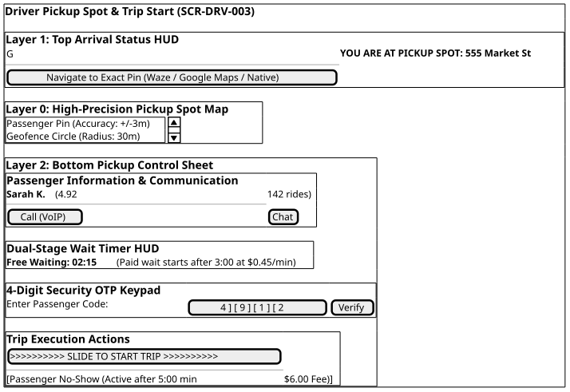
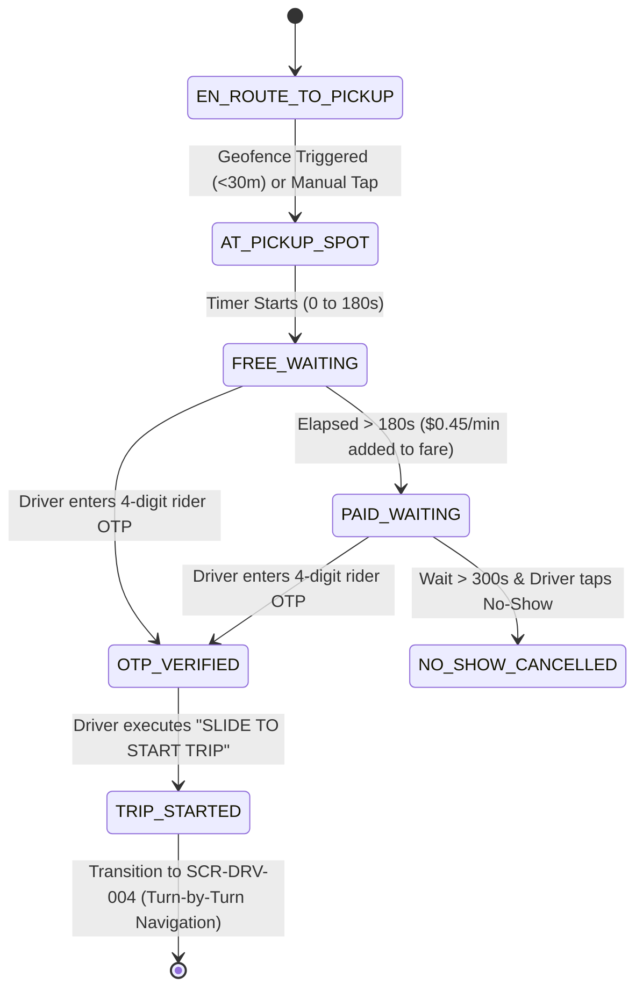

# Screen Contract: Driver Pickup Spot & Trip Start (`SCR-DRV-003`)

This specification defines the driver terminal behavior upon arriving at the rider's pickup location, including automatic/manual arrival triggering, waiting fee accounting, rider OTP entry & verification, and the swipeable `SLIDE TO START TRIP` gesture action.

---

## 1. Visual UI Layout & Component Hierarchy

> [!NOTE]
> **Vector UI Wireframe:** View the standalone vector screen mockup: [driver-pickup-and-start.svg](../wireframes/driver-pickup-and-start.svg) ([.puml source](../wireframes/driver-pickup-and-start.puml)).



> _Source: [diagrams/driver-pickup-and-trip-start.puml](diagrams/driver-pickup-and-trip-start.puml)_

### 1.1 Touch & Gesture Safety Invariants

- **Why a Slider instead of a Button?** While operating a motor vehicle, sudden road vibrations or bumps can cause accidental screen taps. Using a linear `Slide-to-Confirm` swipe gesture requiring $250\text{ pixels}$ of continuous horizontal finger travel prevents false trip starts or unintended cancellations.

---

## 2. Driver Pickup State Machine



---

## 3. Communication Contract (API & WebSocket)

### 3.1 Verify OTP & Start Trip Request (`POST /api/v1/rides/{rideId}/start`)

```json
{
  "ride_id": "ride_77218",
  "driver_id": "drv_9921",
  "otp_code": "4912",
  "pickup_timestamp": "2026-08-16T14:18:45Z",
  "location": {
    "latitude": 37.78971,
    "longitude": -122.40012,
    "accuracy_meters": 4.2
  },
  "wait_duration_seconds": 195,
  "accrued_wait_fare": 0.45
}
```

### 3.2 Success Response (200 OK)

```json
{
  "status": "IN_TRANSIT",
  "ride_id": "ride_77218",
  "trip_start_time": "2026-08-16T14:18:46Z",
  "destination": {
    "address": "San Francisco International Airport, Terminal 2",
    "latitude": 37.6188,
    "longitude": -122.3754
  },
  "navigation_route_polyline": "u{~nFv_hgVw@`Ac@p..."
}
```
