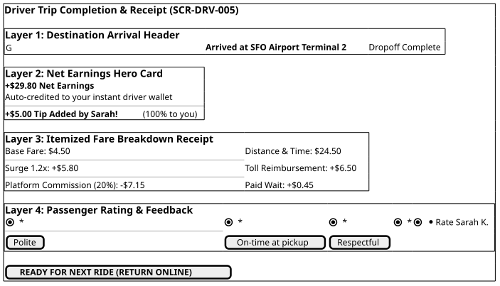
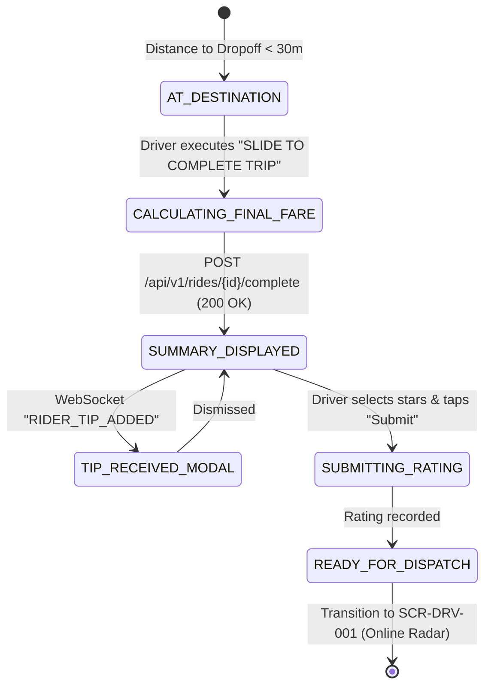

# Screen Contract: Driver Trip Completion & Earnings Summary (`SCR-DRV-005`)

This contract defines the driver terminal behavior upon arriving at the destination, including the `SLIDE TO COMPLETE TRIP` gesture, the transparent fare breakdown receipt, instant tip notifications, rider rating submission, and seamless transition back to the dispatch queue.

---

## 1. Visual UI Layout & Multi-Layer Hierarchy



> _Source: [diagrams/driver-trip-completion-summary.puml](diagrams/driver-trip-completion-summary.puml)_


### 1.1 `Slide to Complete Trip` Gesture

- Prevents premature trip completion while driving.
- Swipe right with tactile haptic confirmation triggers distance/fare aggregation and sends `COMPLETE_TRIP` to server.

### 1.2 Transparent Earnings Receipt Breakdown

- **Gross Fare:** $\$36.00$
  - Base Fare: $\$4.50$
  - Distance ($21.8\text{ km}$): $\$18.50$
  - Time ($24\text{ min}$): $\$6.00$
  - Dynamic Surge ($\times 1.2$): $+\$5.80$
  - Bridge Toll Reimbursement: $+\$6.50$ (100% passed to driver)
  - Paid Wait Time: $+\$0.45$
- **Platform Fee (20% on gross fare excl. tolls):** $-\$7.15$
- **Driver Net Trip Earnings:** **$\$29.80$**
- **Instant Tip Alert:** Real-time push modal when rider adds tip ($+\$5.00\text{ Tip} \rightarrow \text{Total: } \$34.80$).

### 1.3 Passenger Feedback Rating

- 5-Star interactive rating selector.
- Positive quick-tags: `Polite`, `On-time at pickup`, `Respectful`.
- Negative tags (if $\le 3$ stars): `Disrespectful`, `Left trash`, `Unsafe behavior`, `Door slam`.

---

## 2. State Machine & Event Flow



---

## 3. Communication Contract (`POST /api/v1/rides/{rideId}/complete`)

```json
{
  "ride_id": "ride_77218",
  "driver_id": "drv_9921",
  "completion_timestamp": "2026-08-16T14:42:30Z",
  "final_location": {
    "latitude": 37.61882,
    "longitude": -122.37543,
    "accuracy_meters": 3.8
  },
  "odometer_distance_meters": 22100,
  "actual_duration_seconds": 1425,
  "tolls_incurred": [
    {
      "toll_name": "San Francisco-Oakland Bay Bridge",
      "amount": 6.5,
      "currency": "USD"
    }
  ]
}
```
