# Screen Contract: 24/7 Safety Operations SOC Emergency Console (`SCR-OPS-001`)

This contract defines the desktop/web operations console used by Safety Agents during critical SOS triggers, high-G collision detections, and severe safety escalations.

---

## 1. Visual Multi-Pane Desktop Console Layout

```mermaid
flowchart TB
    subgraph DesktopConsole ["🖥️ Safety Operations Center (SOC) Incident Console · Viewport (SCR-OPS-001)"]
        direction TB

        subgraph P0Banner ["🔴 CRITICAL P0 INCIDENT ACTIVE · Ride #77218 · SOS Triggered 14:22:15Z"]
            AlertSummary["⚠️ High-G Crash Sensor Detected (8.4 G Impact) · SFO Airport Corridor · Priority Escalation"]
        end

        subgraph MainSplitView ["Multi-Pane Incident Command Center"]
            direction LR

            subgraph LeftCol ["Telemetry & Spatial Tracking (50% Width)"]
                LiveMap["🗺️ <b>Live Vector Map @ 10 Hz Telemetry</b><br/>Snapped Polyline · Vehicle Marker: 37.78972, -122.40015 (Speed: 0 km/h)"]
                CrashSensor["📈 <b>IMU Accelerometer Telemetry Curve</b><br/>Impact Vector: Front-Left · Peak 8.4 G @ 14:22:14Z · Post-crash stationary"]
            end

            subgraph RightCol ["Parties & Incident Triage (50% Width)"]
                Profiles["👤 <b>Rider:</b> Sarah K. (+14155551234) · Contacted<br/>🚘 <b>Driver:</b> Michael R. · Toyota Camry (7XYZ912)"]
                VoIPConsole["🎙️ <b>3-Way VoIP Bridge:</b> [Operator 🟢] [Rider 🔴] [Driver 🟢]<br/><i>Cabin audio recording enabled & archived</i>"]
                DispatchBridge["🚨 <b>[ PUSH LIVE GPS TO POLICE / 911 PSAP ]</b><br/><i>Transmits real-time cryptographic tracking token link</i>"]
            end
        end

        subgraph BottomAuditBar ["Compliance & Audit Log"]
            AuditTrail["📜 14:22:15Z SOS Signal Ingested ➔ 14:22:18Z Operator Assigned ➔ 14:22:24Z PSAP Notified"]
        end
    end

    style DesktopConsole fill:#0F172A,stroke:#334155,stroke-width:3px
    style P0Banner fill:#7F1D1D,stroke:#EF4444,color:#FFFFFF,stroke-width:2px
    style AlertSummary fill:#991B1B,color:#FFFFFF,stroke-width:1px
    style LeftCol fill:#1E293B,stroke:#475569,stroke-width:1px
    style LiveMap fill:#0284C7,stroke:#0369A1,color:#FFFFFF,stroke-width:1px
    style CrashSensor fill:#0F172A,stroke:#F59E0B,color:#FFFFFF,stroke-width:1px
    style RightCol fill:#1E293B,stroke:#475569,stroke-width:1px
    style Profiles fill:#0F172A,stroke:#334155,color:#FFFFFF,stroke-width:1px
    style VoIPConsole fill:#0F172A,stroke:#10B981,color:#FFFFFF,stroke-width:1px
    style DispatchBridge fill:#DC2626,stroke:#EF4444,color:#FFFFFF,stroke-width:2px
    style BottomAuditBar fill:#1E293B,stroke:#334155,color:#CBD5E1,stroke-width:1px
```




### 1.1 Live 10 Hz High-Frequency Telemetry

- Displays real-time speedometer, braking decel, yaw rate, and collision impact vector.
- Visual breadcrumb trace showing vehicle trajectory $60\text{ seconds}$ leading up to the trigger.

### 1.2 Instant Emergency Services Integration

- **PSAP (911 / 112) Direct Push:** One-click transmission of live cryptographic GPS tracking URL, vehicle make/model/plate, and rider name directly to municipal emergency dispatchers.
- **Automated Recording:** Cabin audio and VoIP call recording automatically preserved with AES-256 encryption for regulatory and legal evidence.

---

## 2. Emergency Escalation Payload (`POST /api/v1/ops/incidents/{id}/escalate-psap`)

```json
{
  "incident_id": "inc_sos_88192a",
  "ride_id": "ride_77218",
  "priority": "P0_CRITICAL",
  "psap_jurisdiction": "SFPD_EMERGENCY_SERVICES",
  "vehicle_snapshot": {
    "license_plate": "7XYZ912",
    "make_model": "Toyota Camry (Silver)",
    "current_coordinates": {
      "latitude": 37.78972,
      "longitude": -122.40015
    },
    "current_speed_kph": 0.0,
    "last_telemetry_timestamp": "2026-08-16T14:22:15Z"
  },
  "emergency_contacts_notified": true,
  "live_tracking_token_url": "https://safety.mobility.io/track/sos_token_77218_live"
}
```
