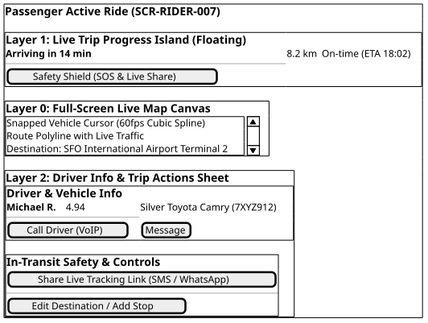

# Screen Contract: Passenger Active Ride (`SCR-RIDER-006`)

This specification governs the live tracking, safety HUD, route rendering, and ETA streaming for an in-transit passenger.

---

## 1. Visual UI Layout & Multi-Layer Hierarchy



> _Source: [diagrams/passenger-active-ride.puml](diagrams/passenger-active-ride.puml)_


---

## 2. Telemetry Ingestion & Interpolation Rules

1. **Dead Reckoning & Bezier Interpolation:**
   - Coordinate updates arrive every 1-2 seconds via WebSocket topic `rides.{rideId}.tracking`.
   - The client animates the vehicle marker using cubic Bezier spline interpolation to ensure 60fps smooth movement across network jitter.
2. **Geofence Proximity Trigger:**
   - When vehicle reaches $< 50\text{ meters}$ from pickup destination, client displays persistent notification and sound chime: `"Your driver has arrived"`.

---

## 3. Inbound WebSocket Event Contract: `RIDE_TELEMETRY_UPDATE`

```json
{
  "event": "RIDE_TELEMETRY_UPDATE",
  "ride_id": "ride_77218",
  "latitude": 37.776102,
  "longitude": -122.41829,
  "bearing": 94.0,
  "speed_kph": 38.4,
  "eta_remaining_seconds": 720,
  "distance_remaining_meters": 3400,
  "current_status": "IN_PROGRESS"
}
```
