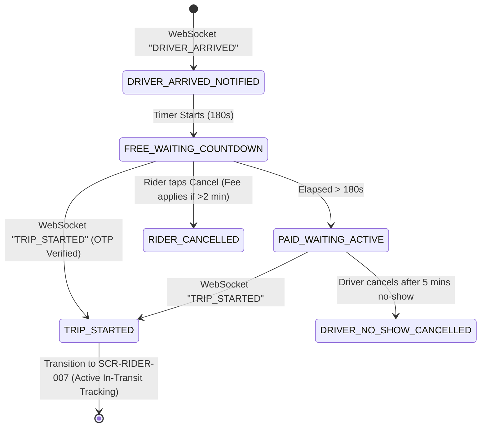

# Screen Contract: Passenger Driver Arrived & Pickup Spot (`SCR-RIDER-006`)

This specification defines the passenger-facing pickup HUD when the driver has arrived at the pickup location, displaying high-contrast vehicle identification, a 4-digit security OTP code, a free waiting countdown timer, and secure communication channels.

---

## 1. Visual UI Layout & Multi-Layer Hierarchy

> [!NOTE]
> **Vector UI Wireframe:** View the standalone vector screen mockup: [passenger-driver-arrived.svg](../wireframes/passenger-driver-arrived.svg) ([.puml source](../wireframes/passenger-driver-arrived.puml)).

```mermaid
flowchart TB
    subgraph PhoneFrame ["📱 Smartphone Viewport · Passenger App (SCR-RIDER-006)"]
        direction TB

        subgraph TopStatus ["Layer 1: Top Status Banner (Floating Island)"]
            StatusText["🟢 <b>✓ DRIVER HAS ARRIVED AT PICKUP SPOT</b>"]
            SafetyIcon["🛡️ Safety Toolkit & Emergency SOS"]
        end

        subgraph MapCanvas ["Layer 0: Full-Screen Map Viewport (Zoomed to Pickup Spot)"]
            CarMarker["🚗 Driver Car Pin (Live Orientation)"]
            WalkingGuide["🚶 Dotted Walking Line to Car: 45m · 1 min walk"]
        end

        subgraph BottomSheet ["Layer 2: Pickup Information & Verification Sheet"]
            direction TB
            subgraph VehicleIdentity ["High-Contrast Vehicle Identification Card"]
                PlateBadge["🏷️ License Plate: <size:16><b>7XYZ912</b></size>"]
                CarModel["🚘 Silver Toyota Camry Hybrid"]
            end

            subgraph OTPCard ["4-Digit Security Ride Verification OTP"]
                OTPBox["🔐 Your Security PIN: <size:18><b>[ 4 ] [ 9 ] [ 1 ] [ 2 ]</b></size><br/><i>Tell this code to the driver to start trip</i>"]
            end

            subgraph DriverProfile ["Driver Profile & Instant Communications"]
                DriverInfo["👤 <b>Alex M.</b> ★ 4.94 (2,840 trips)"]
                Comms["📞 Masked VoIP Call · 💬 In-App Chat"]
            end

            subgraph WaitTimer ["Dual-Stage Waiting Timer Bar"]
                Timer["⏱️ <b>Free Waiting: 02:15 remaining</b> (Paid wait starts after 3:00 at $0.45/min)"]
            end

            CancelBtn["⚪ Cancel Ride (Cancellation fee may apply if > 2 min)"]
        end
    end

    style PhoneFrame fill:#F8FAFC,stroke:#334155,stroke-width:3px
    style TopStatus fill:#ECFDF5,stroke:#059669,stroke-width:2px
    style MapCanvas fill:#E0F2FE,stroke:#0284C7,stroke-width:2px
    style BottomSheet fill:#FFFFFF,stroke:#64748B,stroke-width:2px
    style VehicleIdentity fill:#F1F5F9,stroke:#475569,stroke-width:2px
    style OTPCard fill:#EFF6FF,stroke:#2563EB,stroke-width:2px
    style DriverProfile fill:#F8FAFC,stroke:#CBD5E1,stroke-width:1px
    style WaitTimer fill:#FEF3C7,stroke:#D97706,stroke-width:1px
    style CancelBtn fill:#FFFFFF,stroke:#EF4444,color:#DC2626,stroke-width:1px
```



### 1.1 Bottom Sheet Dynamics & Interaction Hierarchy

| Component Layer              | Visual Design & Hierarchy                                                                   | User Interaction & Dynamic Behavior                                            |
| ---------------------------- | ------------------------------------------------------------------------------------------- | ------------------------------------------------------------------------------ |
| **Top Status Pill**          | Emerald Green banner (`#059669`) with subtle pulse animation.                               | Tapping opens the safety toolkit / live trip sharing modal.                    |
| **High-Contrast Plate Card** | Large bold font on light slate badge (`7XYZ912`).                                           | Allows instant curbside visual recognition of the approaching vehicle.         |
| **Security OTP Box**         | Deep blue outlined elevated card with 4-digit code (`4 9 1 2`).                             | Prevents passenger boarding the wrong car; trip cannot start without it.       |
| **Wait Timer Bar**           | Dual-stage indicator: Green/Slate ($0-3\text{ min}$) $\rightarrow$ Amber ($>3\text{ min}$). | Dynamically computes and displays accrued waiting fees ($+\$0.45/\text{min}$). |
| **Driver Comms Bar**         | Split buttons for VoIP Call and In-App Chat.                                                | Routes through Twilio/WebRTC voice proxy with virtual number masking.          |


---

## 2. State Transitions & Event Flow



---

## 3. WebSocket Real-Time Inbound Payload

```json
{
  "event": "DRIVER_ARRIVED",
  "ride_id": "ride_77218",
  "arrived_at": "2026-08-16T14:15:30Z",
  "free_wait_seconds": 180,
  "paid_wait_rate_per_minute": 0.45,
  "currency": "USD",
  "pickup_otp": "4912",
  "driver_exact_location": {
    "latitude": 37.78972,
    "longitude": -122.40015,
    "bearing": 94.0
  }
}
```
