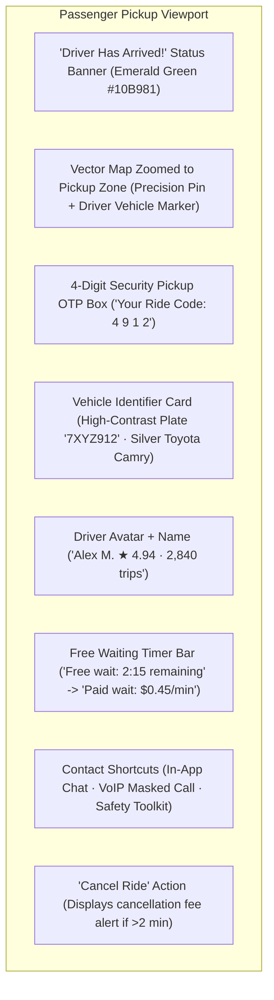
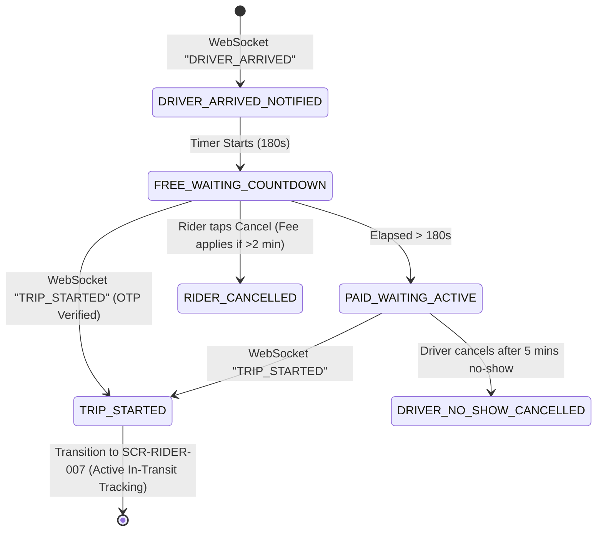

# Screen Contract: Passenger Driver Arrived & Pickup Spot (`SCR-RIDER-006`)

This specification defines the passenger-facing pickup HUD when the driver has arrived at the pickup location, displaying high-contrast vehicle identification, a 4-digit security OTP code, a free waiting countdown timer, and secure communication channels.

---

## 1. UI Components & Visual Layout



### 1.1 Vehicle Identification & Visual Contrast

- **High-Contrast Plate Banner:** Rendered in large bold font (`7XYZ912`) to allow immediate visual recognition in crowded curbside environments.
- **Car Visualizer:** Color badge (`Silver Metallic`) and 3D vehicle silhouette corresponding to the driver's registered vehicle.
- **Pickup Spot Walking Guide:** Dotted walking polyline with walking duration if passenger is $>30\text{ meters}$ away from vehicle pin.

### 1.2 4-Digit Security OTP

- To prevent riders from boarding the wrong vehicle, a large-format 4-digit code (`4 9 1 2`) is displayed in an elevated modal.
- Driver cannot start the trip on their terminal without entering or NFC-verifying this code.

### 1.3 Waiting Time & Pricing Indicator

- **Free Waiting Window (0:00 to 3:00 mins):** Circular countdown timer in Neutral Slate.
- **Paid Waiting Mode (> 3:00 mins):** Progress bar turns Amber (`#F59E0B`) displaying real-time accrued wait fees:
  $$\text{Wait Fee} = \max(0, t_{\text{elapsed}} - 180\text{ s}) \times \$0.45/\text{min}$$

---

## 2. State Transitions & Event Flow



---

## 3. WebSocket Real-Time Inbound Payload

```json
{
  "event": "DRIVER_ARRIVED",
  "ride_id": "ride_77218",
  "arrived_at": "2026-08-16T14:15:30Z",
  "free_wait_seconds": 180,
  "paid_wait_rate_per_minute": 0.45,
  "currency": "USD",
  "pickup_otp": "4912",
  "driver_exact_location": {
    "latitude": 37.78972,
    "longitude": -122.40015,
    "bearing": 94.0
  }
}
```
