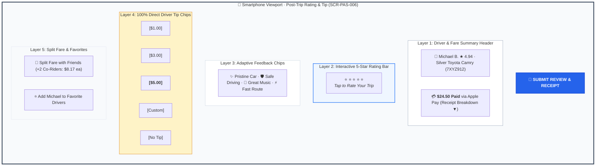
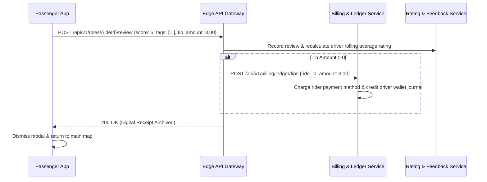

# Screen Contract: Passenger Rating, Tipping & Split Fare (`SCR-PAS-006`)

This specification defines the post-trip settlement modal, 5-star interactive rating, driver tipping selector, feedback tag matrix, and split fare breakdown.

---

## 1. Visual UI Layout & Multi-Layer Hierarchy




### 1.1 Header & Fare Summary

- **Driver Profile Pill:** Circular driver avatar with verified badge, vehicle make/model, and license plate.
- **Trip Receipt Summary:** Large header showing final charge (`$24.50`) with breakdown expander (Base fare `$18.00`, Surge `$3.50`, Tolls `$3.00`).

### 1.2 Interactive Rating & Adaptive Tag Matrix

- **5-Star Rating Bar:** Haptic-responsive star glyphs.
- **Adaptive Tags (Based on Star Score):**
  - **5 Stars (Compliments):** `✨ Pristine Car`, `🛡️ Safe Driving`, `🎵 Great Music`, `💬 Polite Conversation`, `⚡ Quick Route`.
  - **1–3 Stars (Constructive Complaints):** `⚠️ Reckless Driving`, `🚬 Car Odor`, `🛑 Unsafe Drop-off`, `📱 Phone Distraction`, `🗺️ Bad Route Choice`.

### 1.3 Driver Tipping Chips

- Fast one-tap tipping chips: `[$1.00]`, `[$3.00]`, `[$5.00]`, `[Custom]`, `[No Tip]`.
- Note: 100% of tips are disbursed directly to driver partner earnings ledger without platform commission.

### 1.4 Split Fare Drawer (Optional Sub-Flow)

- Allows rider to split invoice equally or proportionally among up to 4 registered phone contacts.
- Real-time indicator showing split shares (e.g. 3 riders $\to$ `$8.17` each).

---

## 2. Review & Tipping Submission Sequence



---

## 3. Screen Submission Contract Payload

```json
{
  "ride_id": "ride_88192a7",
  "score": 5,
  "feedback_tags": ["PRISTINE_CAR", "SAFE_DRIVING", "QUICK_ROUTE"],
  "comment": "Michael was courteous and took the express highway smoothly.",
  "tip": {
    "amount": 3.0,
    "currency": "USD",
    "payment_method_id": "pm_apple_pay_8819"
  },
  "is_favorite_driver_opt_in": true,
  "split_fare": {
    "is_split": true,
    "participants": [
      {
        "phone_number": "+14155551111",
        "share_amount": 13.75,
        "status": "ACCEPTED"
      },
      {
        "phone_number": "+14155552222",
        "share_amount": 13.75,
        "status": "PENDING"
      }
    ]
  }
}
```
