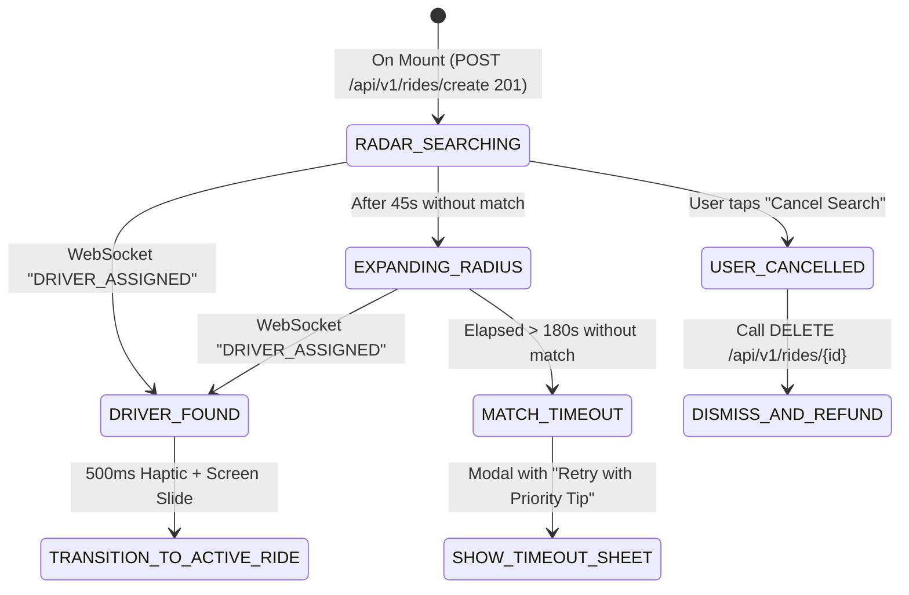

# Screen Contract: Passenger Ride Search & Driver Matching (`SCR-RIDER-005`)

This contract defines the client-side state machine, WebSocket event bindings, timeout escalation, and UX behavior during driver matching.

---

## 1. UI Components & Visual Layout

- **Map Canvas:** Full-screen vector map centered on pickup point with pulsating concentric blue radar rings.
- **Top HUD:** Pickup address pill with estimated wait time indicator (`~2-4 min`).
- **Bottom Floating Sheet:**
  - Animated pulsing radar graphic.
  - Selected Tariff info (e.g. _Economy_ · \$18.50).
  - Countdown progress bar (0 to 180 seconds).
  - Primary Action Button: `Cancel Search` (Elevated outline style).

---

## 2. State & Event Invariants



---

## 3. Communication Contract (WebSocket & Polling Fallback)

### WebSocket Inbound Event: `DRIVER_ASSIGNED`

```json
{
  "event": "DRIVER_ASSIGNED",
  "ride_id": "ride_77218",
  "driver": {
    "id": "drv_9921",
    "name": "Alex M.",
    "photo_url": "https://cdn.mobility.io/drivers/drv_9921.jpg",
    "rating": 4.94,
    "total_trips": 2840,
    "vehicle": {
      "make": "Toyota",
      "model": "Camry Hybrid",
      "color": "Silver",
      "license_plate": "7XYZ912"
    },
    "current_location": {
      "latitude": 37.7791,
      "longitude": -122.4201,
      "bearing": 182.0
    },
    "pickup_eta_seconds": 180
  },
  "pickup_otp": "4912"
}
```

### Fallback Polling

If WebSocket disconnects, the client initiates exponential backoff HTTP polling:

- `GET /api/v1/rides/{rideId}/status` every $3\text{ seconds}$ until re-established.
