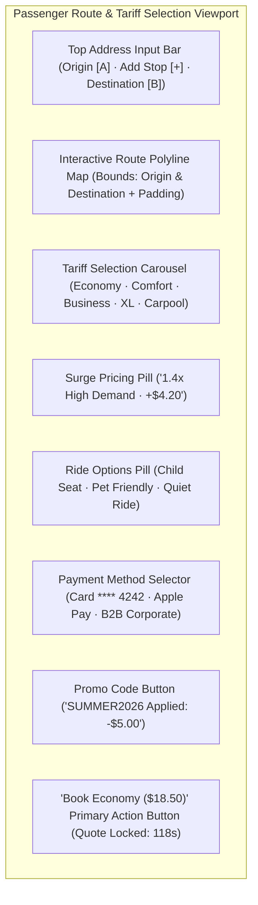
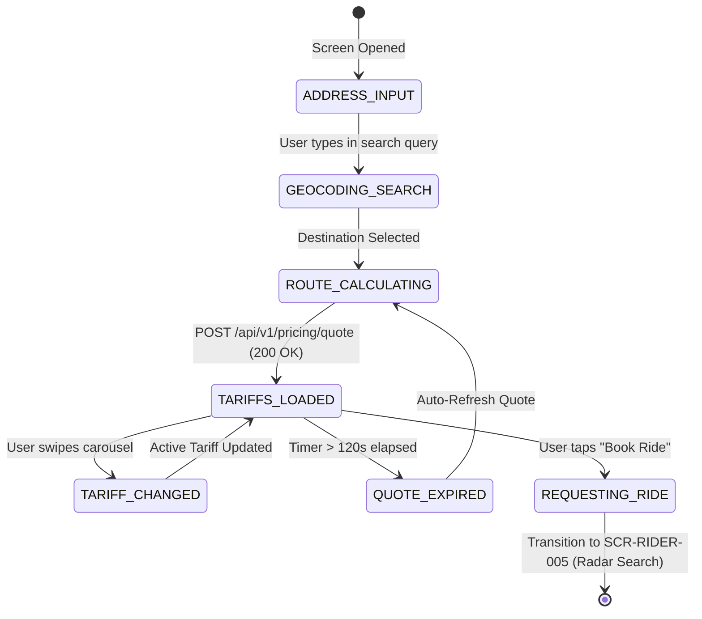

# Screen Contract: Passenger Route & Tariff Selection (`SCR-RIDER-002`)

This contract defines the client-side interaction, geocoding autocomplete, multi-stop route configuration, tariff selection carousel, dynamic surge multipliers, and upfront fare quote locking.

---

## 1. UI Layout & Component Hierarchy



### 1.1 Address Input & Geocoding Bar

- **Origin Pin (A):** Pre-filled with client GPS geocoded location; editable by tap or map pin drag.
- **Add Stop Button (+):** Supports up to 2 intermediate waypoints ($A \rightarrow W_1 \rightarrow W_2 \rightarrow B$).
- **Destination Input (B):** Focus-triggered full-screen overlay with:
  - Saved Places (Home, Work, Gym).
  - Recent Search History with timestamps.
  - Debounced autocomplete search ($300\text{ ms}$) via Geocoding API.

### 1.2 Interactive Route Canvas

- Renders primary route polyline in Platform Blue (`#2563EB`) with estimated travel duration pill (`24 min · 11.4 km`).
- Renders alternative grey routes with differential badges (`+4 min`, `Toll Free`).

### 1.3 Tariff Carousel & Surge Multiplier HUD

- Horizontal snap-carousel displaying available platform vehicle categories:
  - **Economy (Standard 4-seater):** Base tariff, highest availability.
  - **Comfort (Spacious newer sedans):** Top-rated drivers, extra legroom.
  - **Business (Executive Black):** Luxury vehicles, bottled water, professional chauffeur.
  - **XL (6-seater SUV/Minivan):** Large groups and extra luggage.
  - **Carpool (Shared Rides):** Discounted multi-passenger corridor sharing.
- **Dynamic Surge Indicator:** Displays flame icon with real-time surge multiplier badge (`⚡ 1.4x High Demand`) with tooltip explaining weather/event supply-demand imbalance.
- **Quote Lock Timer:** Upfront fare price is cryptographically locked for $120\text{ seconds}$ with a countdown indicator.

---

## 2. Client State Machine & Invariants



---

## 3. Communication Contracts & Payloads

### 3.1 Upfront Quote Request (`POST /api/v1/pricing/quote`)

```json
{
  "passenger_id": "usr_88192a",
  "waypoints": [
    {
      "sequence": 0,
      "address": "555 Market St, San Francisco, CA",
      "latitude": 37.7897,
      "longitude": -122.4001,
      "type": "PICKUP"
    },
    {
      "sequence": 1,
      "address": "San Francisco International Airport (SFO)",
      "latitude": 37.6188,
      "longitude": -122.3754,
      "type": "DROPOFF"
    }
  ],
  "client_timestamp": "2026-08-16T14:00:00Z"
}
```

### 3.2 Quote Response with Cryptographic Lock

```json
{
  "quote_id": "qte_99381b10a",
  "expires_at": "2026-08-16T14:02:00Z",
  "duration_seconds": 1440,
  "distance_meters": 21800,
  "route_polyline": "u{~nFv_hgVw@`Ac@p...",
  "tariffs": [
    {
      "category_id": "economy",
      "name": "Economy",
      "eta_pickup_minutes": 3,
      "fare_amount": 28.5,
      "currency": "USD",
      "surge_multiplier": 1.35,
      "surge_flat_bonus": 0.0,
      "is_surge_active": true,
      "quote_signature": "sha256:7f83b1657ff1fc53b92dc18148a1d65dfc2d4b1fa3d677284addd200126d9069"
    },
    {
      "category_id": "comfort",
      "name": "Comfort",
      "eta_pickup_minutes": 5,
      "fare_amount": 36.0,
      "currency": "USD",
      "surge_multiplier": 1.2,
      "surge_flat_bonus": 0.0,
      "is_surge_active": true,
      "quote_signature": "sha256:4b227777d4dd1fc61c6f884f48641d02b4d121d3fd328cb08b5531fcacdabf8a"
    },
    {
      "category_id": "business",
      "name": "Business Executive",
      "eta_pickup_minutes": 8,
      "fare_amount": 58.0,
      "currency": "USD",
      "surge_multiplier": 1.0,
      "surge_flat_bonus": 0.0,
      "is_surge_active": false,
      "quote_signature": "sha256:ef2d127de37b942baad06145e54b0c619a1f22327b2ebbcfbec78f5564afe39d"
    }
  ]
}
```
