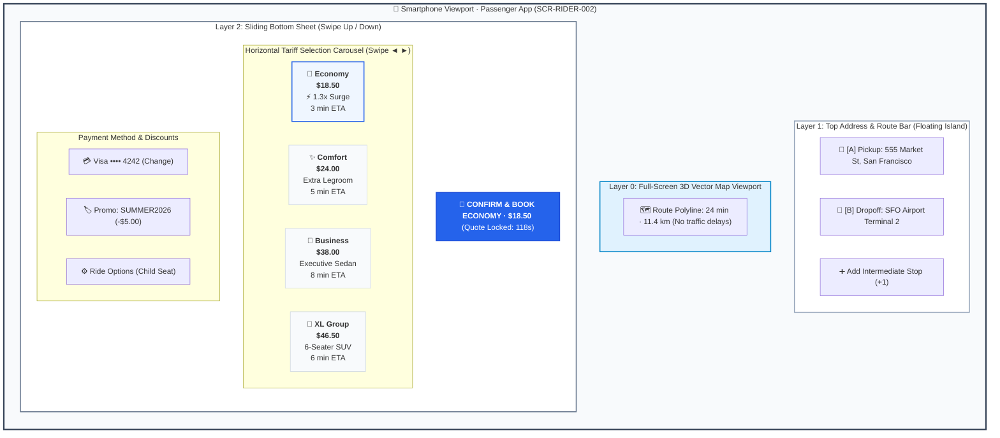
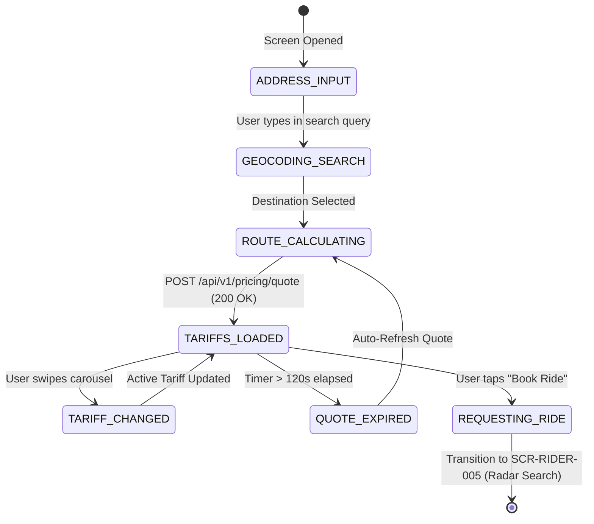

# Screen Contract: Passenger Route & Tariff Selection (`SCR-RIDER-002`)

This contract defines the client-side interaction, geocoding autocomplete, multi-stop route configuration, tariff selection carousel, dynamic surge multipliers, and upfront fare quote locking.

---

## 1. Visual UI Layout & Multi-Layer Hierarchy

> [!NOTE]
> **Vector UI Wireframe:** View the standalone vector screen mockup: [passenger-route-selection.svg](../wireframes/passenger-route-selection.svg) ([.puml source](../wireframes/passenger-route-selection.puml)).



### 1.1 Bottom Sheet Dynamics & Expansion Heights

The bottom sheet utilizes a 3-tier gesture-driven spring animation:

| Height Tier                 | Pixel Height            | Visible Elements                                                                                          | User Trigger                                |
| --------------------------- | ----------------------- | --------------------------------------------------------------------------------------------------------- | ------------------------------------------- |
| **Collapsed**               | $160\text{ dp}$         | Active tariff name, price ($18.50), Surge pill, and Primary CTA button.                                   | Default map exploration mode.               |
| **Half-Expanded (Default)** | $380\text{ dp}$         | Full tariff carousel, payment selector, promo code chip, and CTA button.                                  | Upon route calculation response.            |
| **Fully Expanded**          | $100\%\text{ Viewport}$ | Full address input overlay, saved places (Home/Work), and advanced ride options (Child seat, quiet ride). | Tapping origin or destination input fields. |


---

## 2. Client State Machine & Invariants



---

## 3. Communication Contracts & Payloads

### 3.1 Upfront Quote Request (`POST /api/v1/pricing/quote`)

```json
{
  "passenger_id": "usr_88192a",
  "waypoints": [
    {
      "sequence": 0,
      "address": "555 Market St, San Francisco, CA",
      "latitude": 37.7897,
      "longitude": -122.4001,
      "type": "PICKUP"
    },
    {
      "sequence": 1,
      "address": "San Francisco International Airport (SFO)",
      "latitude": 37.6188,
      "longitude": -122.3754,
      "type": "DROPOFF"
    }
  ],
  "client_timestamp": "2026-08-16T14:00:00Z"
}
```

### 3.2 Quote Response with Cryptographic Lock

```json
{
  "quote_id": "qte_99381b10a",
  "expires_at": "2026-08-16T14:02:00Z",
  "duration_seconds": 1440,
  "distance_meters": 21800,
  "route_polyline": "u{~nFv_hgVw@`Ac@p...",
  "tariffs": [
    {
      "category_id": "economy",
      "name": "Economy",
      "eta_pickup_minutes": 3,
      "fare_amount": 28.5,
      "currency": "USD",
      "surge_multiplier": 1.35,
      "surge_flat_bonus": 0.0,
      "is_surge_active": true,
      "quote_signature": "sha256:7f83b1657ff1fc53b92dc18148a1d65dfc2d4b1fa3d677284addd200126d9069"
    },
    {
      "category_id": "comfort",
      "name": "Comfort",
      "eta_pickup_minutes": 5,
      "fare_amount": 36.0,
      "currency": "USD",
      "surge_multiplier": 1.2,
      "surge_flat_bonus": 0.0,
      "is_surge_active": true,
      "quote_signature": "sha256:4b227777d4dd1fc61c6f884f48641d02b4d121d3fd328cb08b5531fcacdabf8a"
    },
    {
      "category_id": "business",
      "name": "Business Executive",
      "eta_pickup_minutes": 8,
      "fare_amount": 58.0,
      "currency": "USD",
      "surge_multiplier": 1.0,
      "surge_flat_bonus": 0.0,
      "is_surge_active": false,
      "quote_signature": "sha256:ef2d127de37b942baad06145e54b0c619a1f22327b2ebbcfbec78f5564afe39d"
    }
  ]
}
```
