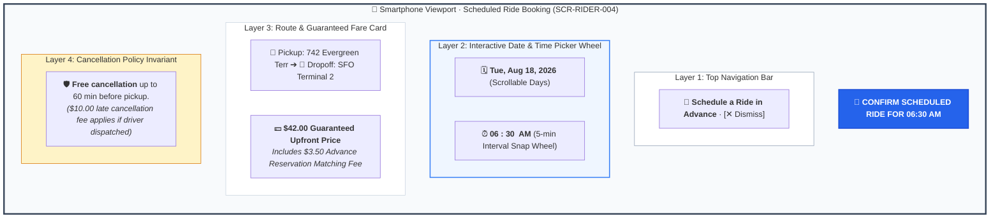

# Screen Contract: Passenger Scheduled Ride Booking (`SCR-RIDER-004`)

This contract defines the client-side interaction for booking rides in advance (from 30 minutes up to 7 days ahead), guaranteed fare quotes, booking modification, and cancellation policy invariants.

---

## 1. Visual UI Layout & Multi-Layer Hierarchy




### 1.1 Advance Time Picker

- Date selector: Today, Tomorrow, or specific calendar date up to 7 days.
- Time wheel: 5-minute granularity intervals.
- Minimum advance booking notice: $30\text{ minutes}$.

### 1.2 Guaranteed Fare Quote & Invariants

- Upfront fare price is locked and guaranteed regardless of real-time surge multiplier fluctuations at the moment of actual pickup ($T_{\text{pickup}}$).
- Small advance reservation fee ($\$3.50$) included for driver commitment matching.

### 1.3 Cancellation Rules Invariant

- **Free Cancellation:** If cancelled $\ge 60\text{ minutes}$ prior to $T_{\text{pickup}}$.
- **Late Cancellation Fee ($10.00):** If cancelled $<60\text{ minutes}$ before pickup after a dedicated driver has already accepted the advance assignment.

---

## 2. Communication Contract (`POST /api/v1/rides/schedule`)

```json
{
  "passenger_id": "usr_88192a",
  "scheduled_pickup_time": "2026-08-18T06:30:00Z",
  "origin": {
    "address": "742 Evergreen Terrace, San Francisco, CA",
    "latitude": 37.7749,
    "longitude": -122.4194
  },
  "destination": {
    "address": "San Francisco International Airport (SFO)",
    "latitude": 37.6188,
    "longitude": -122.3754
  },
  "tariff_category": "comfort",
  "guaranteed_fare": 42.0,
  "currency": "USD",
  "payment_method_id": "pm_card_visa_4242"
}
```
