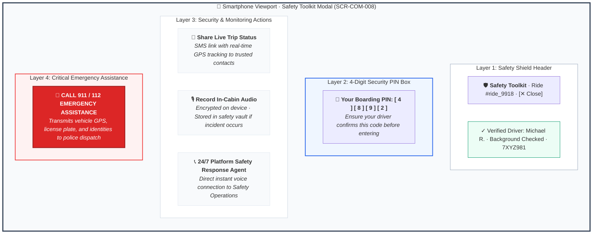
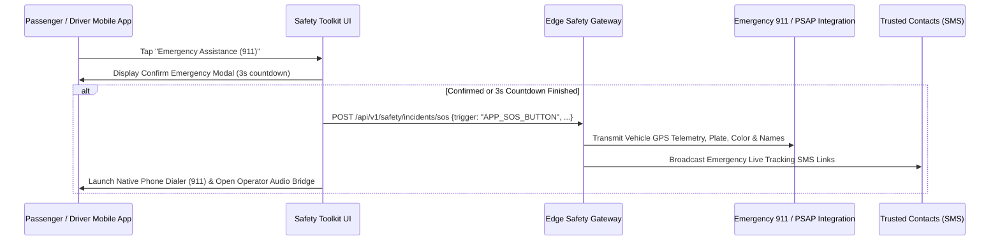

# Screen Contract: Safety Toolkit Bottom Sheet (`SCR-COM-008`)

This specification defines the universal Safety Toolkit modal accessible to riders and drivers during active trips via the persistent floating Shield Icon (`🛡️`).

---

## 1. Visual UI Layout & Multi-Layer Hierarchy




### 1.1 Header & Trust Badges

- **Title:** `Safety Toolkit` with verified platform shield (`🛡️`).
- **Vehicle Match Assurance Banner:** High-visibility banner confirming:
  - License Plate: `7XYZ981`
  - Vehicle: `Silver Toyota Camry`
  - Driver: `Michael R. · Background Checked & Biometrically Verified`

### 1.2 4-Digit Boarding PIN Security Code

- Prominently displays the 4-digit OTP code (`4892`) generated for the ride.
- Instruction: _“Verify this PIN with your driver before getting in to ensure you are in the right vehicle.”_

### 1.3 In-Cabin Encrypted Audio Recording

- Tile enabling user to start a silent encrypted audio recording stored on device and uploaded to the platform vault if an incident is reported.
- Pulsating red status indicator: `🔴 Recording Active (Encrypted on Device)`.

### 1.4 Share Live Trip Link

- Displays active trusted contacts with quick toggles to dispatch SMS tracking tokens.

### 1.5 Emergency Assistance & 911 / 112 Direct Call

- **Critical Action Button:** High-contrast Crimson Red (`#DC2626`).
- Tapping triggers immediate dialer pre-populated with emergency services while transmitting vehicle telemetry and passenger identities directly to the local PSAP via CAD integration.

---

## 2. Emergency Trigger Sequence



---

## 3. Toolkit State Contract Payload

```json
{
  "ride_id": "ride_991823a",
  "verification_pin": {
    "is_pin_required": true,
    "pin_code": "4892",
    "is_verified_by_driver": true
  },
  "in_cabin_audio_recording": {
    "is_enabled": true,
    "recording_session_id": "aud_sess_77189a",
    "is_recording_active": true,
    "encryption_algorithm": "AES-256-GCM"
  },
  "trusted_contacts": [
    {
      "contact_id": "cnt_01",
      "name": "Emma (Spouse)",
      "phone_number": "+14155551234",
      "is_auto_share_enabled": true,
      "last_notification_sent_at": "2026-08-16T18:02:15Z"
    }
  ],
  "emergency_services": {
    "local_emergency_number": "911",
    "psap_cad_integration_supported": true,
    "platform_safety_hotline": "+18005559911"
  }
}
```
