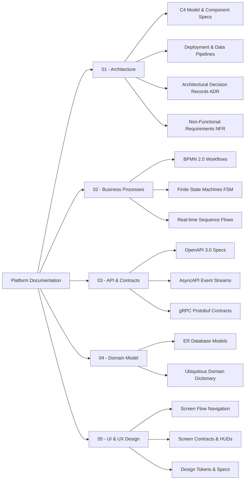

# Urban Mobility Platform - Architecture & System Design Documentation

Welcome to the comprehensive technical documentation for the next-generation **Urban Mobility Platform** (an enterprise-grade, distributed Uber-like ride-hailing and B2B dispatch architecture).

---

## 🗺️ Documentation Map

---

## 📂 Quick Navigation by Module

### 1. [Architecture & System Design](01-architecture/)

- **C4 Model Diagrams:**
  - [System Context (Level 1)](01-architecture/c4/C4_Elements.svg) ([.puml](01-architecture/c4/01-context.puml))
  - [Container Architecture (Level 2)](01-architecture/c4/C4_Containers.svg) ([.puml](01-architecture/c4/02-containers.puml))
  - [Matching Service Components (Level 3)](01-architecture/c4/components/C4_Matching_Service_Components.svg) ([.puml](01-architecture/c4/components/matching-service.puml))
  - [Location Service Components (Level 3)](01-architecture/c4/components/C4_Location_Service_Components.svg) ([.puml](01-architecture/c4/components/location-service.puml))
  - [Billing Service Components (Level 3)](01-architecture/c4/components/C4_Billing_Service_Components.svg) ([.puml](01-architecture/c4/components/billing-service.puml))
- **Deployment & Streaming Topologies:**
  - [Kubernetes (EKS / GKE) Production Topology](01-architecture/deployment/Kubernetes_Deployment_Topology.svg) ([.puml](01-architecture/deployment/k8s-deployment-topology.puml))
  - [Multi-Region Active-Active & DR Topology](01-architecture/deployment/Multi_Region_DR_Topology.svg) ([.puml](01-architecture/deployment/multi-region-dr-topology.puml))
  - [Real-time Geospatial Streaming & ML Feature Pipeline](01-architecture/deployment/Data_Pipeline_Architecture.svg) ([.puml](01-architecture/deployment/data-pipeline-architecture.puml))
- **Architectural Decision Records (ADRs):**
  - [ADR-0000: ADR Template](01-architecture/adr/0000-template.md)
  - [ADR-0001: Apache Kafka as Distributed Event Spine](01-architecture/adr/0001-use-kafka-for-events.md)
  - [ADR-0002: Uber H3 Spatial Index for Surge & Dispatch](01-architecture/adr/0002-spatial-index-h3.md)
  - [ADR-0003: PostgreSQL for Immutable Double-Entry Ledger](01-architecture/adr/0003-postgresql-for-billing.md)
  - [ADR-0004: Transactional Outbox Pattern with Debezium CDC](01-architecture/adr/0004-transactional-outbox-pattern.md)
  - [ADR-0005: Dynamic Surge Pricing Algorithm & Elasticity Model](01-architecture/adr/0005-surge-pricing-algorithm.md)
  - [ADR-0006: Telemetry Protocol Selection (gRPC vs WebSocket vs MQTT)](01-architecture/adr/0006-telemetry-protocol-grpc-vs-mqtt-vs-ws.md)
  - [ADR-0007: Distributed Locking Strategy with Redis & Lua](01-architecture/adr/0007-redis-distributed-locking-strategy.md)
- **Non-Functional Requirements (NFRs):**
  - [Performance & Scalability Targets](01-architecture/nfr/performance-and-scalability.md)
  - [Security, Zero-Trust & PCI DSS Compliance](01-architecture/nfr/security-and-pci-dss.md)
  - [Fault Tolerance, High Availability & SLA](01-architecture/nfr/fault-tolerance-sla.md)
  - [Observability, Distributed Tracing & Metrics Standards](01-architecture/nfr/observability-and-tracing.md)
  - [Data Privacy, GDPR/CCPA & GPS Trajectory Retention](01-architecture/nfr/gdpr-and-data-retention.md)

### 2. [Business Processes & System Dynamics](02-business-processes/)

- **Mathematical Algorithms & Optimization:**
  - [Batched Bipartite Matching (Hungarian / MCMF)](02-business-processes/algorithms/matching-optimization-algorithm.md)
  - [Dynamic Surge Pricing Formula & Elasticity Model](02-business-processes/algorithms/dynamic-surge-formula.md)
  - [ML Travel Time (ETA) Residual Routing Correction](02-business-processes/algorithms/eta-routing-ml-correction.md)
  - [Dead Reckoning Extended Kalman Filter & Map Snapping](02-business-processes/algorithms/dead-reckoning-kalman-filter.md)
- **BPMN 2.0 Workflows:**
  - [Ride Execution Lifecycle](02-business-processes/bpmn/ride-execution-flow.svg) ([.bpmn](02-business-processes/bpmn/ride-execution-flow.bpmn))
  - [Driver Automated KYC & Vehicle Inspection](02-business-processes/bpmn/driver-kyc-verification.svg) ([.bpmn](02-business-processes/bpmn/driver-kyc-verification.bpmn))
  - [Scheduled Rides Dispatch & Liveness SLA](02-business-processes/bpmn/scheduled-rides-dispatch.svg) ([.bpmn](02-business-processes/bpmn/scheduled-rides-dispatch.bpmn))
  - [Safety Incident Detection & Emergency SOS Escalation](02-business-processes/bpmn/safety-incident-escalation.svg) ([.bpmn](02-business-processes/bpmn/safety-incident-escalation.bpmn))
  - [Carpool Shared Rides Dynamic Multi-Stop Matching](02-business-processes/bpmn/carpool-shared-rides.svg) ([.bpmn](02-business-processes/bpmn/carpool-shared-rides.bpmn))
  - [B2B Corporate & Fleet Onboarding](02-business-processes/bpmn/b2b-partner-onboarding.svg) ([.bpmn](02-business-processes/bpmn/b2b-partner-onboarding.bpmn))
  - [Dispute Resolution & Fare Adjustments](02-business-processes/bpmn/dispute-resolution.svg) ([.bpmn](02-business-processes/bpmn/dispute-resolution.bpmn))

- **State Machines (FSM):**
  - [Order & Trip Lifecycle](02-business-processes/state-machines/order-lifecycle.md)
  - [Driver Shift & Liveness Status](02-business-processes/state-machines/driver-status.md)
  - [Payment & Ledger State Machine](02-business-processes/state-machines/payment-status.md)
- **Sequence Diagrams:**
  - [Order Creation & Fare Pre-Auth](02-business-processes/sequence-diagrams/Order_Creation_Sequence.svg) ([.puml](02-business-processes/sequence-diagrams/order-creation-flow.puml))
  - [Driver Spatial Matching & 15s Ringing Loop](02-business-processes/sequence-diagrams/Driver_Matching_Sequence.svg) ([.puml](02-business-processes/sequence-diagrams/driver-matching-flow.puml))
  - [B2B Fleet Settlement & Automated Payouts](02-business-processes/sequence-diagrams/B2B_Payout_Sequence.svg) ([.puml](02-business-processes/sequence-diagrams/b2b-payout-flow.puml))

### 3. [APIs & Communication Contracts](03-api-and-contracts/)

- **REST OpenAPI 3.0:**
  - [Mobile Gateway API (Passenger & Driver)](03-api-and-contracts/openapi/mobile-gateway-api.yaml)
  - [Driver Onboarding & KYC API](03-api-and-contracts/openapi/driver-onboarding-api.yaml)
  - [Safety & Emergency SOS Incident API](03-api-and-contracts/openapi/safety-and-sos-api.yaml)
  - [Promotions & Loyalty Engine API](03-api-and-contracts/openapi/promotions-and-loyalty-api.yaml)
  - [B2B Enterprise Webhooks & Expense API](03-api-and-contracts/openapi/b2b-webhooks-api.yaml)
  - [B2B Client & Corporate Dispatch API](03-api-and-contracts/openapi/b2b-client-api.yaml)
  - [Platform Administration & Operations API](03-api-and-contracts/openapi/admin-api.yaml)
- **Event-Driven AsyncAPI 2.6:**
  - [Driver Geolocation Telemetry Stream](03-api-and-contracts/asyncapi/driver-geolocations-stream.yaml)
  - [Safety Telemetry Alerts & Crash Detection Stream](03-api-and-contracts/asyncapi/safety-telemetry-alerts-stream.yaml)
  - [Surge Grid Real-Time Broadcast Stream](03-api-and-contracts/asyncapi/surge-grid-broadcast-stream.yaml)
  - [Order Lifecycle Events Stream](03-api-and-contracts/asyncapi/order-events-stream.yaml)
  - [Billing & Financial Transactions Stream](03-api-and-contracts/asyncapi/billing-events-stream.yaml)
- **gRPC Protocol Buffers v3:**
  - [Routing & Distance Matrix Service (`routing_v1.proto`)](03-api-and-contracts/proto/routing_v1.proto)
  - [Pricing & Tariff Engine Service (`pricing_v1.proto`)](03-api-and-contracts/proto/pricing_v1.proto)
  - [Matching & Dispatch Service (`matching_v1.proto`)](03-api-and-contracts/proto/matching_v1.proto)
  - [Location & Telemetry Service (`location_v1.proto`)](03-api-and-contracts/proto/location_v1.proto)
  - [Billing & Financial Ledger Service (`billing_v1.proto`)](03-api-and-contracts/proto/billing_v1.proto)
  - [Fraud & GPS Spoofing Prevention Service (`fraud_v1.proto`)](03-api-and-contracts/proto/fraud_v1.proto)

### 4. [Domain Model & Data Architecture](04-domain-model/)

- **Entity-Relationship Models:**
  - [Core Relational Database (PostgreSQL)](04-domain-model/er-diagrams/Core_Database_ER.svg) ([.puml](04-domain-model/er-diagrams/core-database-er.puml))
  - [Location & Spatial Database (Redis + ClickHouse)](04-domain-model/er-diagrams/Location_Database_ER.svg) ([.puml](04-domain-model/er-diagrams/location-database-er.puml))
  - [Billing & Ledger Database (PostgreSQL)](04-domain-model/er-diagrams/Billing_Database_ER.svg) ([.puml](04-domain-model/er-diagrams/billing-database-er.puml))
- **Physical SQL DDL Schemas:**
  - [Core Domain DDL Migration (`001_core_schema.sql`)](04-domain-model/sql-ddl/001_core_schema.sql)
  - [Double-Entry Ledger DDL Migration (`002_billing_ledger_schema.sql`)](04-domain-model/sql-ddl/002_billing_ledger_schema.sql)
  - [ClickHouse Telemetry OLAP DDL (`003_clickhouse_telemetry_schema.sql`)](04-domain-model/sql-ddl/003_clickhouse_telemetry_schema.sql)
- **Data Governance & Contracts:**
  - [Redis Key Naming & Kafka Topic Standards](04-domain-model/data-contracts.md)
  - [Domain Dictionary (Ubiquitous Language)](04-domain-model/domain-dictionary.md)

### 5. [UI / UX Design as Code](05-ui-and-ux/)

- **Screen Flows & Wireframes:**
  - [Passenger App Navigation Graph](05-ui-and-ux/screen-flows/Passenger_App_Screen_Flow.svg) ([.puml](05-ui-and-ux/screen-flows/passenger-app-flow.puml))
  - [Driver App Shift & Offer Graph](05-ui-and-ux/screen-flows/Driver_App_Screen_Flow.svg) ([.puml](05-ui-and-ux/screen-flows/driver-app-flow.puml))
  - [Driver KYC & Vehicle Photo Inspection Flow](05-ui-and-ux/screen-flows/Driver_KYC_Upload_Screen_Flow.svg) ([.puml](05-ui-and-ux/screen-flows/driver-kyc-upload-flow.puml))
  - [B2B Dispatcher Web Wireframes](05-ui-and-ux/screen-flows/B2B_Dispatch_Wireframe.svg) ([.puml](05-ui-and-ux/screen-flows/b2b-dispatch-wireframes.puml))
- **Screen Contracts:**
  - [Passenger Ride Search & Radar](05-ui-and-ux/screen-contracts/passenger-ride-search.md)
  - [Passenger Active Ride & Live Tracking](05-ui-and-ux/screen-contracts/passenger-active-ride.md)
  - [Passenger Rating, Tipping & Split Fare](05-ui-and-ux/screen-contracts/passenger-rating-and-tip.md)
  - [Universal Safety Toolkit & Emergency SOS](05-ui-and-ux/screen-contracts/safety-toolkit-modal.md)
  - [Driver 15-Second Offer Modal](05-ui-and-ux/screen-contracts/driver-order-offer.md)
  - [Driver Turn-by-Turn Active Navigation](05-ui-and-ux/screen-contracts/driver-active-navigation.md)
  - [B2B Dispatcher Multi-Pane Board](05-ui-and-ux/screen-contracts/b2b-dispatch-board.md)
- **Design Tokens & Specs:**
  - [Color Palette Tokens (`colors.json`)](05-ui-and-ux/design-tokens/colors.json)
  - [Typography Tokens (`typography.json`)](05-ui-and-ux/design-tokens/typography.json)
  - [UI Components Specification](05-ui-and-ux/design-tokens/components-spec.md)

---

## 🛠️ Viewing & Tooling Compatibility

- **GitHub Native Viewing:** All architecture, sequence, database ER, and UI screen flow diagrams are pre-rendered into standalone `.svg` files for crisp vector viewing on any device.
- **Obsidian:** All `.md` files contain native Mermaid diagrams and Markdown links. Diagrams authored in `.puml` can be rendered using the _Obsidian PlantUML_ plugin.
- **MkDocs Material:** Build and preview locally with `mkdocs serve`.
- **API Tooling:** Load OpenAPI and AsyncAPI YAML files directly into Swagger UI, Postman, or AsyncAPI Studio.
