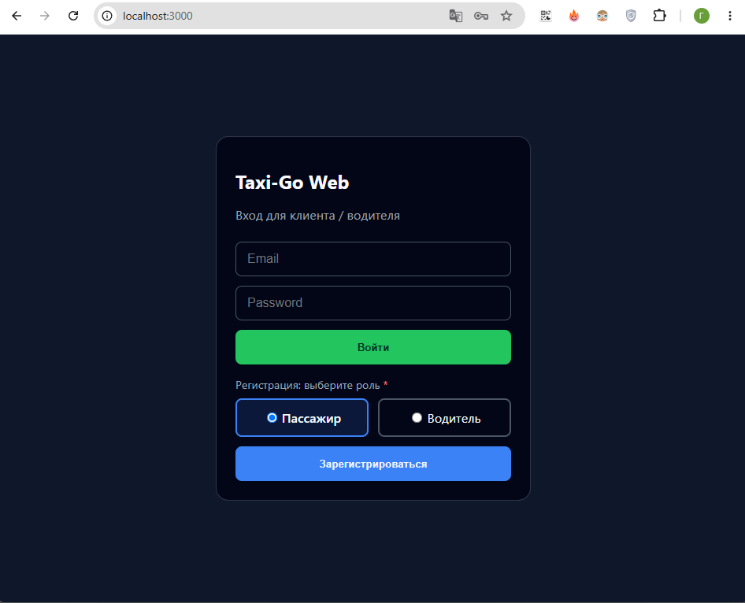
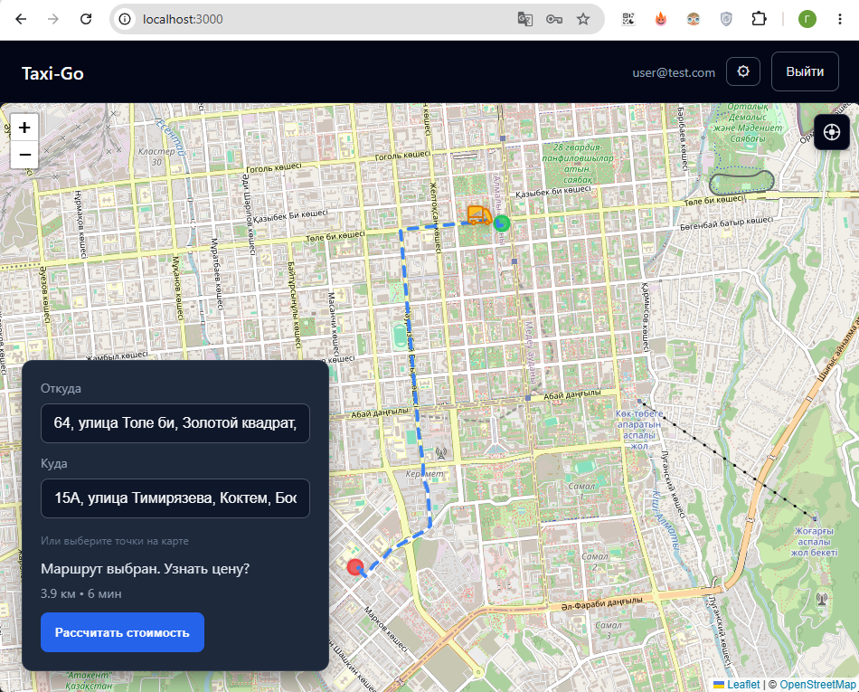
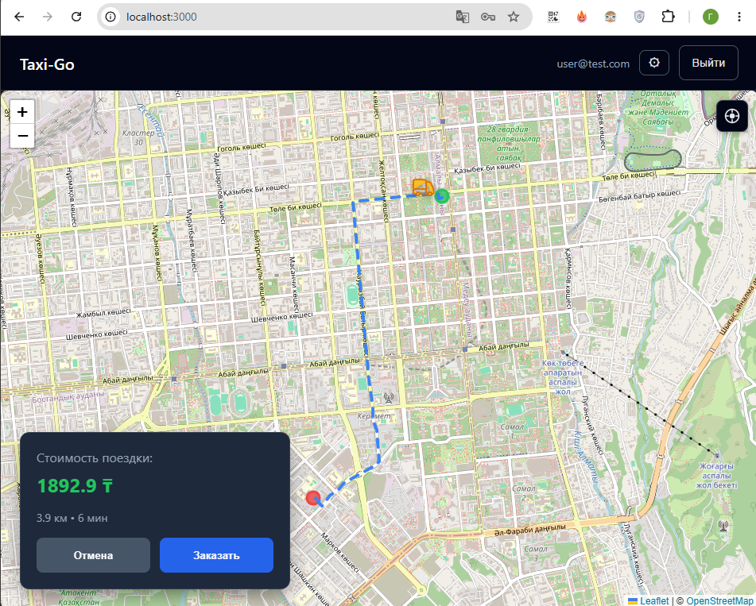
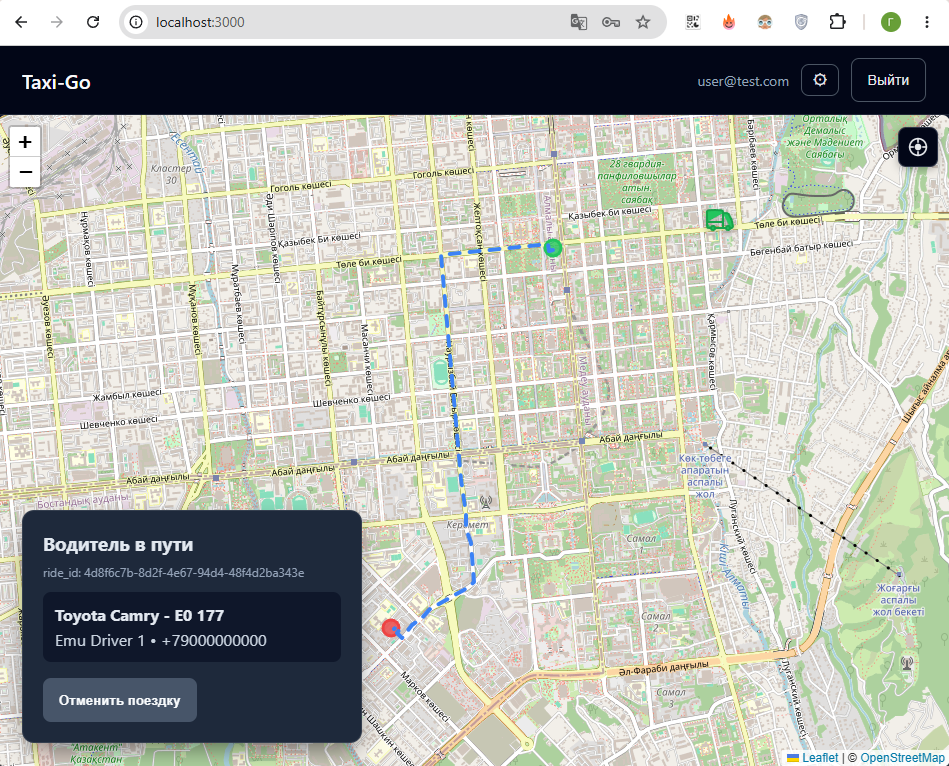
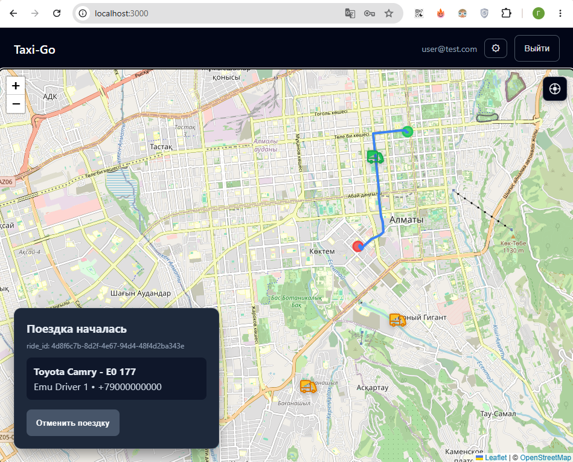
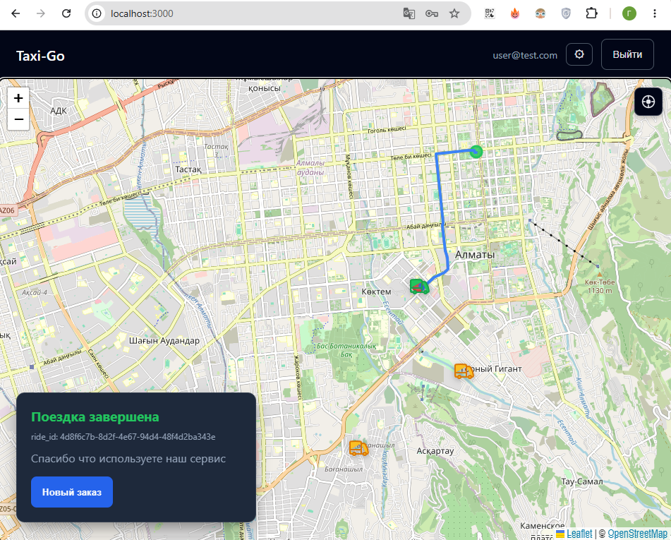
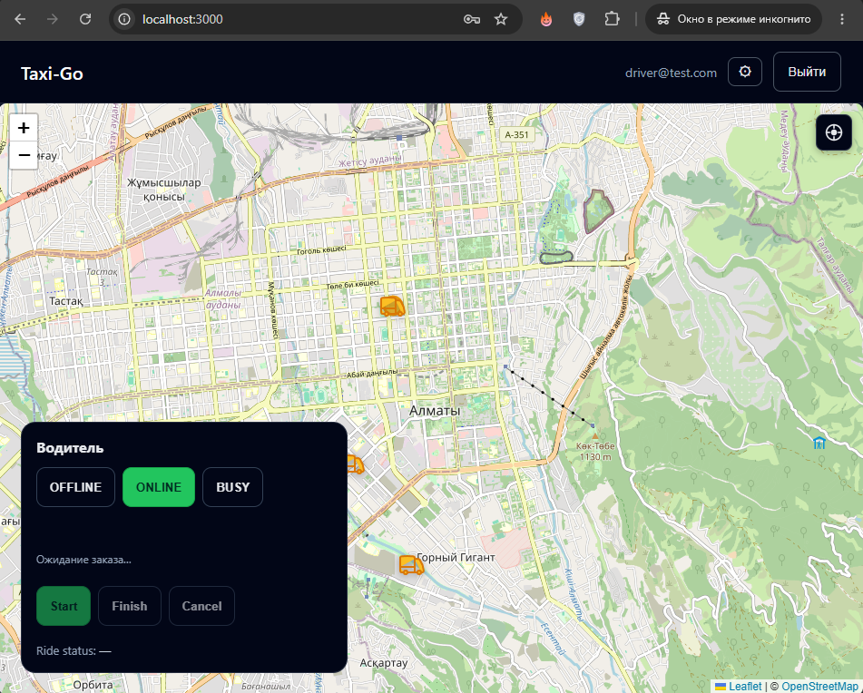
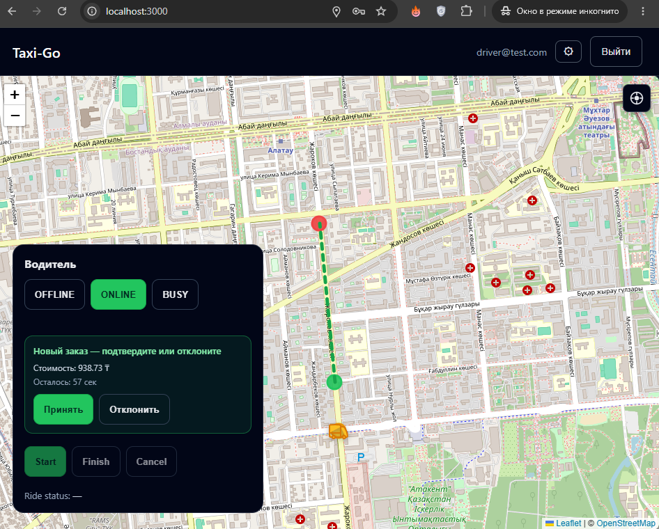
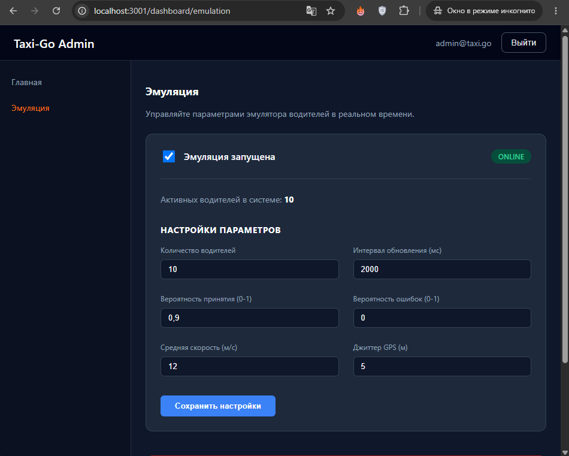

# Служба заказа такси

Я сделал прототип службы заказа такси.

Основной целью было создать бэкенд и реализовать матчинг (поиск водителя).
Стек: микросервисы на Go, сразу с расчетом на высокую нагрузку. PostgreSQL, Redis, Kafka, Tarantool (для матчинга). Фронтенд на Next.js

## Интерфейс пассажира:

## Интерфейс водителя:

## Интерфейс администратора:

Здесь можно задать параметры для эмулятора водителей, чтобы тестировать поиск ближайшего водителя. Когда ближайший водитель, созданный эмулятором, найден, эмулятор автоматически принимает заказ и двигает значок водителя до точки назначения по маршруту.

## Приложение

Также реализовал приложение на Android с использованием Cordova. Использовал нативные модули для работы с геолокацией (отправка координат пользователя) и push-уведомлениями, а основная часть - на Webview, чтобы сделать прототип проще. Поэтому приложение выглядит как веб версия (за исключением экрана настроек).

## Демо

По запросу могу дать ссылку на тестовый сервер. Сайт запускается на Github Codespaces, который сделан для разработки и поэтому контейнеры засыпают через полчаса бездействия. Чтобы запустилось, мне сначала надо проделать некторые действия.

